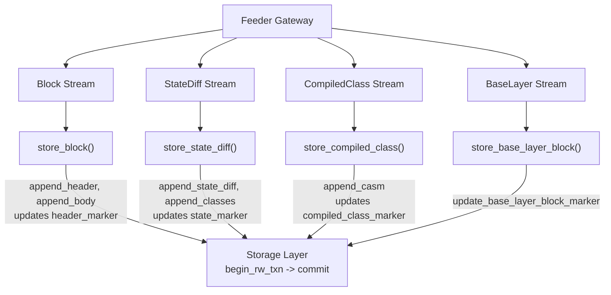
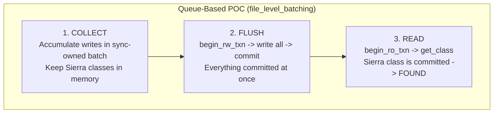

---

name: RO Uncommitted Exposure Review

overview: Comprehensive review of every RO operation in the synchronization flow, categorizing each as safe without uncommitted exposure or requiring it, and analyzing how the queue-based POC handled the cases that do.

todos:

  - id: verify-parent-fix

content: Keep last block header in memory on CentralSync to avoid RO read for verify_parent_block_hash

status: pending

  - id: sierra-cache-fix

content: Cache Sierra classes in HashMap on CentralSync during store_state_diff, use in store_compiled_class instead of storage read

status: pending

  - id: remove-sync-filter

content: Consider removing the redundant sync-layer deprecated class filter at lib.rs:450-465 (storage layer handles dedup)

status: pending

isProject: false

---

# Review: RO Exposure to Uncommitted Data During Sync

## Architecture Context

The sync loop in [`crates/apollo_central_sync/src/lib.rs`](crates/apollo_central_sync/src/lib.rs) runs 4 concurrent streams via `select!`:



**Ordering guarantee:** Streams are sequential within `select!`. The event loop processes ONE event at a time. There is NO concurrent writes -- only one `store_*` runs at a time.

**With batching:** `commit()` increments a counter but only flushes the MDBX transaction when `counter >= batch_size`. Data stays in the persistent RW transaction between flushes.

---

## All RO Operations in Central Sync -- Categorized

### Category 1: SAFE Without Uncommitted Exposure (Marker Reads)

These reads check "where are we?" to decide what to fetch next. They run in stream generators, NOT during write processing. A slightly stale marker just means the stream waits longer -- no correctness issue.

| Location | Function | What It Reads | Why Safe |

|----------|----------|---------------|----------|

| [lib.rs:756](crates/apollo_central_sync/src/lib.rs) | `stream_new_blocks` | `get_header_marker()` | Drives download range; stale = slower, not wrong |

| [lib.rs:765](crates/apollo_central_sync/src/lib.rs) | `stream_new_blocks` | `get_state_marker()` | Checks if state is caught up for pending sync |

| [lib.rs:804-806](crates/apollo_central_sync/src/lib.rs) | `stream_new_state_diffs` | `get_state_marker()`, `get_header_marker()` | Drives download range; `state_marker <= header_marker` guaranteed by ordering |

| [lib.rs:892-895](crates/apollo_central_sync/src/lib.rs) | `stream_new_compiled_classes` | `get_compiled_class_marker()`, `get_state_marker()`, `get_compiler_backward_compatibility_marker()` | Drives download range |

| [lib.rs:961](crates/apollo_central_sync/src/lib.rs) | `stream_new_base_layer_block` | `get_header_marker()` | Marker only |

| [lib.rs:994-1009](crates/apollo_central_sync/src/lib.rs) | `check_sync_progress` | All markers | Monitoring only |

| [lib.rs:497](crates/apollo_central_sync/src/lib.rs) | `store_state_diff` | `get_compiler_backward_compatibility_marker()` | Reads marker set by earlier committed blocks |

| [lib.rs:584](crates/apollo_central_sync/src/lib.rs) | `store_state_diff` | `get_compiled_class_marker()` | Marker only, used for class manager update |

| [lib.rs:638](crates/apollo_central_sync/src/lib.rs) | `store_compiled_class` | `get_compiled_class_marker()` | Marker read after write, used for class manager update |

**Verdict: 9 RO operations are safe without uncommitted exposure.**

However, there is a subtle but important nuance: with batching, the marker reads in streams (e.g., `get_header_marker()` in `stream_new_state_diffs`) will see **stale** committed markers if the batch hasn't flushed. This means:

- `stream_new_state_diffs` reads `header_marker` to know its upper bound
- If `store_block` wrote 50 blocks but batch hasn't flushed, `header_marker` is still at the old committed value
- The state diff stream will "wait" because it thinks there are no new blocks yet
- When the batch eventually flushes, the markers jump forward and the stream catches up

**This is correct but slow** -- batching effectively stalls dependent streams until flush.

### Category 2: SAFE Without Uncommitted Exposure (Data Reads Behind Marker)

These reads access data that is guaranteed to be committed because the data was written in earlier, already-committed blocks (behind the marker).

| Location | Function | What It Reads | Why Safe |

|----------|----------|---------------|----------|

| [lib.rs:898](crates/apollo_central_sync/src/lib.rs) | `stream_new_compiled_classes` | `get_state_diff(from)` where `from < state_marker` | State diff was committed before marker advanced |

| [sources/central/state_update_stream.rs:359-384](crates/apollo_central_sync/src/sources/central/state_update_stream.rs) | `download_class_if_necessary` | `get_class_definition_at()`, `get_deprecated_class_definition_at()` at `state_marker` | Classes read at committed state number |

| [sources/central.rs:204](crates/apollo_central_sync/src/sources/central.rs) | `stream_compiled_classes` | `get_state_diff(bn)` for `bn < state_marker` | Behind committed marker |

| [pending_sync.rs:33-46](crates/apollo_central_sync/src/pending_sync.rs) | `sync_pending_data` | `get_header_marker()`, `get_block_header(prev)` | Only runs when fully synced (all committed) |

**Verdict: 4 more RO operations are safe without uncommitted exposure.**

### Category 3: REQUIRES Uncommitted Exposure (2 operations)

These are the problematic cases where an RO read during sync processing needs to see data written by a previous `store_*` call that hasn't been flushed yet.

#### Problem 1: `verify_parent_block_hash` -- [lib.rs:688-707](crates/apollo_central_sync/src/lib.rs)

```rust
fn verify_parent_block_hash(&self, block_number: BlockNumber, block: &Block) -> StateSyncResult {
    let prev_hash = self.reader.begin_ro_txn()?
        .get_block_header(prev_block_number)?  // <-- needs block N-1's header
        ...
}
```

- **What it reads:** The header of block N-1
- **Why it needs uncommitted data:** `store_block(N-1)` wrote block N-1's header and called `commit()`. With batching, this didn't flush. Now `store_block(N)` calls `verify_parent_block_hash` which needs to read block N-1's header -- but it's only in the unflushed transaction.
- **Without uncommitted exposure:** `get_block_header(N-1)` returns `None` -> panic/error

#### Problem 2: `store_compiled_class` reads Sierra class -- [lib.rs:607](crates/apollo_central_sync/src/lib.rs)

```rust
let class = self.reader.begin_ro_txn()?.get_class(&class_hash)?
    .expect("Compiled classes stream gave class hash that doesn't appear in storage.");
```

- **What it reads:** The Sierra contract class for a class hash
- **Why it needs uncommitted data:** `store_state_diff(N)` wrote the Sierra class via `append_classes()`. Later, `store_compiled_class(N)` needs to read that Sierra class to send to the class manager. With batching, the Sierra class is only in the unflushed transaction.
- **Without uncommitted exposure:** `get_class()` returns `None` -> panic

### Category 4: Potentially Problematic (1 operation)

#### `store_state_diff` deprecated class filter -- [lib.rs:450-465](crates/apollo_central_sync/src/lib.rs)

```rust
let txn = self.reader.begin_ro_txn()?;
let state_reader = txn.get_state_reader()?;
state_reader.get_deprecated_class_definition_block_number(&class_hash)
```

- **What it reads:** Whether a deprecated class was already declared
- **Without uncommitted exposure:** If block 100 declared class `0x123` (unflushed), block 101's filter won't see it and will try to declare it again. However, the storage-layer `write_deprecated_classes()` has its own dedup check within the same MDBX transaction, so this doesn't cause an error -- just a redundant write attempt that gets caught.
- **Verdict:** Not strictly a problem but wastes work. The storage layer's internal filter handles it.

---

## How the Queue-Based POC (file_level_batching branch) Handled This

The earlier POC on the `dean/file_level_batching` branch took a fundamentally different approach: **the sync layer owned the batch queue, not the storage layer**.



**Key design:** In `flush_processed_batch()`:

1. All data from multiple blocks was collected into a batch (Sierra classes, CASMs, state diffs, headers)
2. Everything was written in ONE `begin_rw_txn` -> ... -> `commit()` call
3. The Sierra class read for the class manager happened AFTER commit, so the data was guaranteed to be in MDBX

**Why it worked:**

- Sync OWNED the queue and KNEW when flush happened
- Sync could defer reads to after flush (COLLECT -> COMMIT -> READ pattern)
- `verify_parent_block_hash` was done with data from the batch (already in memory), not from storage

**Why the current approach (storage-layer batching) is different:**

- Storage owns the batch and controls when to flush
- Sync doesn't know when the batch is flushed
- Sync can't defer reads because it doesn't control the commit timing

---

## Summary Table

| # | RO Operation | Location | Data | Needs Uncommitted? | Queue POC Solution |

|---|-------------|----------|------|--------------------|--------------------|

| 1 | `get_header_marker` (streams) | lib.rs:756,804,961,994 | Marker | No (stale = slower) | N/A |

| 2 | `get_state_marker` (streams) | lib.rs:765,804,894,995 | Marker | No (stale = slower) | N/A |

| 3 | `get_compiled_class_marker` (streams) | lib.rs:893,584,638,994 | Marker | No | N/A |

| 4 | `get_compiler_backward_compat_marker` | lib.rs:497,895 | Marker | No | N/A |

| 5 | `get_state_diff(from)` in compiled stream | lib.rs:898 | State diff behind marker | No | N/A |

| 6 | `download_class_if_necessary` | state_update_stream.rs:359 | Classes at state_marker | No | N/A |

| 7 | `get_state_diff(bn)` in source stream | central.rs:204 | State diff behind marker | No | N/A |

| 8 | `sync_pending_data` reads | pending_sync.rs:33 | Header marker + header | No (fully synced) | N/A |

| 9 | **`verify_parent_block_hash`** | **lib.rs:699** | **Block N-1 header** | **YES** | POC kept headers in memory batch |

| 10 | **`get_class` for class manager** | **lib.rs:607** | **Sierra class** | **YES** | POC deferred read to after commit |

| 11 | `get_deprecated_class_defn_block_number` | lib.rs:451 | Deprecated class existence | No (storage-layer dedup handles it) | POC had no sync-layer filter |

**Result: Out of 15+ RO operations in the sync flow, only 2 strictly require uncommitted exposure.**

---

## Options for the 2 Problematic Operations

Both were handled in the POC by keeping data in memory. The same approach works with storage-layer batching:

- **`verify_parent_block_hash` (Problem 1):** Keep the last written block header in memory on the `CentralSync` struct. Use it for parent hash verification instead of reading from storage. Only fall back to storage read for the very first block after startup.

- **`get_class` for class manager (Problem 2):** When `store_state_diff` processes classes, save the Sierra classes in an in-memory `HashMap<ClassHash, SierraContractClass>` on the `CentralSync` struct. In `store_compiled_class`, read from this cache instead of storage. This was already discussed and agreed upon in the earlier conversation.

Both solutions avoid the need for RO transactions to see uncommitted data entirely.