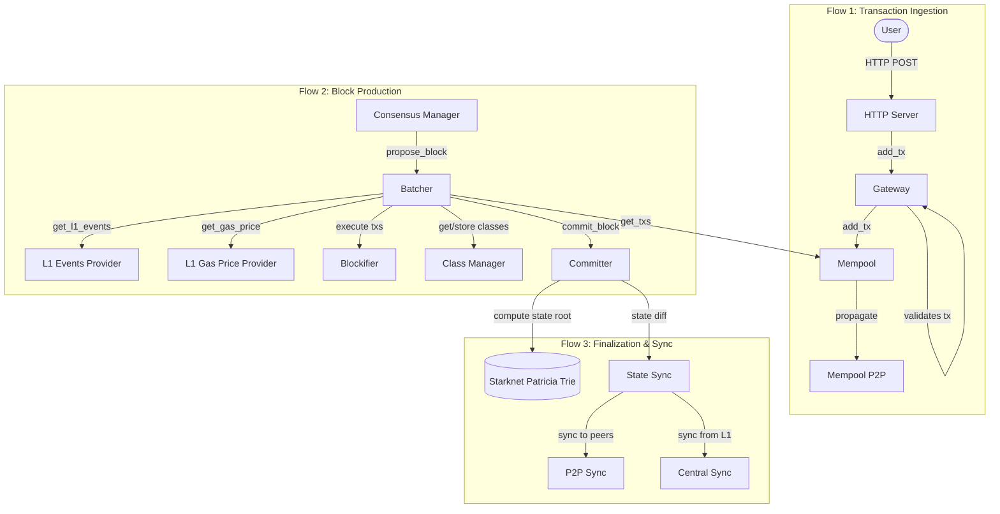

[↑ Index](README.md) | [→ Next: 02 — The Component Model](02-component-model.md)

---

# 01 — High-Level Overview

## What is Apollo?

Apollo is Starknet's sequencer. Its job is to:

1. **Receive transactions** from users via HTTP.
2. **Order and execute** those transactions to produce blocks.
3. **Finalize** those blocks by computing and committing state roots to Ethereum (L1).
4. **Sync** the resulting state to other nodes in the network.

It is written entirely in Rust and structured as a collection of loosely-coupled **components**, each running as an independent async service. Components communicate through a uniform RPC-style interface — either over in-process channels (when co-located) or over HTTP (when running in separate processes). This means you can deploy everything on a single machine or spread it across many without changing any application code — only configuration changes.

---

## The Three Major Flows



---

## All Components at a Glance

| Component | Crate(s) | Role |
|-----------|----------|------|
| **HTTP Server** | `apollo_http_server` | Exposes the public JSON-RPC/REST API; routes user transactions to Gateway |
| **Gateway** | `apollo_gateway` | Validates and classifies incoming transactions before they enter the Mempool |
| **Mempool** | `apollo_mempool` | Holds pending transactions, ordered by fee/nonce; serves them to the Batcher |
| **Mempool P2P** | `apollo_mempool_p2p` | Propagates transactions to peer sequencers over libp2p |
| **Consensus Manager** | `apollo_consensus_manager` | Runs the consensus protocol (Tendermint/PBFT-style); drives the Batcher to propose/validate blocks |
| **Batcher** | `apollo_batcher` | Pulls transactions from Mempool, executes them via Blockifier, builds block proposals |
| **Blockifier** | `blockifier` | Cairo VM execution engine; applies state transitions |
| **Class Manager** | `apollo_class_manager` | Caches and serves Cairo contract classes; coordinates with Sierra Compiler |
| **Sierra Compiler** | `apollo_compile_to_casm` | Compiles Sierra (high-level Cairo) to CASM (bytecode) |
| **L1 Events Provider** | `apollo_l1_events` | Tracks L1→L2 messages and deposits from Ethereum |
| **L1 Events Scraper** | `apollo_l1_events` | Polls Ethereum for new L1 events and feeds them into L1 Events Provider |
| **L1 Gas Price Provider** | `apollo_l1_gas_price` | Tracks Ethereum gas prices for fee calculation |
| **L1 Gas Price Scraper** | `apollo_l1_gas_price` | Polls Ethereum for gas prices and feeds them into L1 Gas Price Provider |
| **Committer** | `apollo_committer` | Computes Starknet state root (Patricia Merkle Trie) and commits blocks |
| **State Sync** | `apollo_state_sync` | Synchronises state from L1 (central sync) and from P2P peers |
| **Signature Manager** | `apollo_signature_manager` | Signs consensus votes with the sequencer's private key |
| **Proof Manager** | `apollo_proof_manager` | Manages ZK proof generation/verification lifecycle |
| **Config Manager** | `apollo_config_manager` | Hot-reloads dynamic node configuration at runtime |
| **Monitoring Endpoint** | `apollo_monitoring_endpoint` | Exposes Prometheus metrics and health endpoints |

---

## Key Architectural Properties

**Topology is configuration, not code.** Every component has an `execution_mode` in config:
- `LocalExecutionWithRemoteDisabled` — runs locally, no remote interface exposed
- `LocalExecutionWithRemoteEnabled` — runs locally AND exposes an HTTP port for remote callers
- `Remote` — does not run locally; calls go to another process over HTTP
- `Disabled` — not used in this deployment

**Single binary, many roles.** The binary is `apollo_node`. A single invocation can be a full node or just one shard of a distributed deployment — the components that are enabled depend entirely on config.

**Storage is per-component.** Apollo uses MDBX (via `apollo_storage`) for the Batcher and State Sync, and RocksDB with Patricia Merkle trees (`starknet_patricia`) for the Committer.

---

## Crate Naming Convention

Every component follows a three-crate pattern:

```
apollo_<component>          # Business logic
apollo_<component>_config   # Configuration structs (implement SerializeConfig)
apollo_<component>_types    # Shared types, Client trait, Request/Response enums
```

The types crate is what other components import — it defines the public API surface. The logic crate is an internal implementation detail.

---

## Check Your Understanding

> Relevant file: `architecture/01-overview.md`

1. A user submits a transaction. Name the two components it passes through before it is stored in the Mempool.
2. Which component is responsible for actually running Cairo smart contract code?
3. If you want to run the Gateway on a separate machine from the Mempool, what configuration change would you make (conceptually)?
4. What are the three crates you would expect to find for the `apollo_batcher` component?

---

[↑ Index](README.md) | [→ Next: 02 — The Component Model](02-component-model.md)
