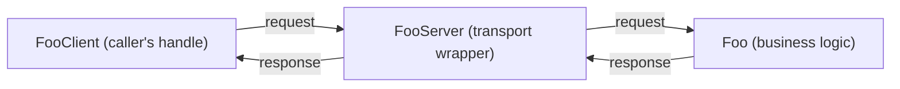
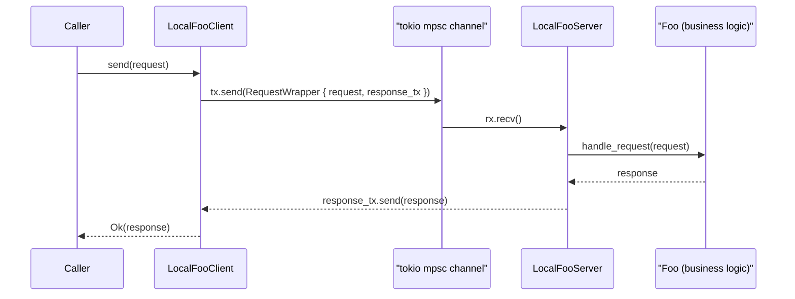
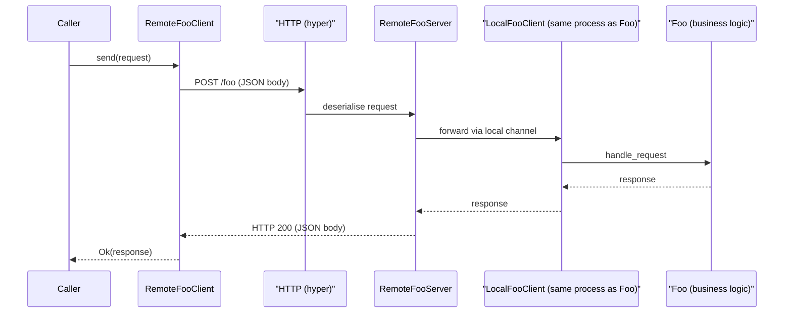
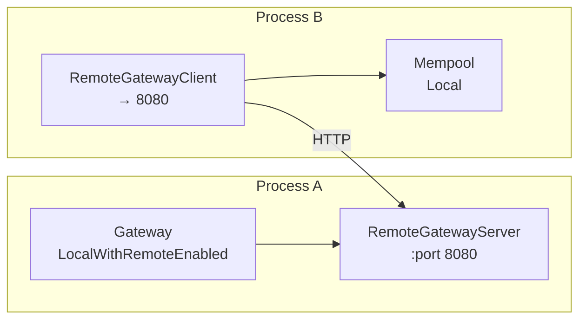

[↑ Index](README.md) | [← Prev: 01 — Overview](01-overview.md) | [→ Next: 03 — Component Reference](03-components.md)

---

# 02 — The Component Model (Infrastructure Pattern)

This is one of the most important things to understand in the codebase. Before reading component-specific code, you need to understand the infrastructure that every component is built on top of.

## The Core Problem Being Solved

In a distributed system you want components to be:

- Testable in isolation (no network required)
- Deployable either locally (in one process) or remotely (in separate processes)
- Communicating through a uniform, typed interface

Apollo solves this with a **component server / component client** abstraction provided by the `apollo_infra` crate.

---

## The Client / Server Pattern

For every component `Foo` there is a matching client and server type. The client is the caller's typed handle; the server wraps the component's business logic and dispatches incoming requests to it:

The client and server can be wired together **two ways**:

### Local (in-process)

The `RequestWrapper` bundles the request with a one-shot channel for the response.

### Remote (cross-process over HTTP)

The **same Foo logic** is used in both cases. The difference is purely the transport.

---

## Server Types

`apollo_infra` provides four concrete server wrappers:

| Type                             | Used for                                                                                                                           | Concurrency model                                             |
| -------------------------------- | ---------------------------------------------------------------------------------------------------------------------------------- | ------------------------------------------------------------- |
| `LocalComponentServer`           | Request-response components that must handle one request at a time (e.g., Batcher, Mempool)                                        | Sequential — processes one message from the channel at a time |
| `ConcurrentLocalComponentServer` | Request-response components that can handle many concurrent requests (e.g., Class Manager, Gateway, Sierra Compiler)               | Spawns a tokio task per request, bounded by `max_concurrency` |
| `RemoteComponentServer`          | Accepts inbound HTTP requests from a remote client and forwards them to a local channel                                            | Hyper HTTP server                                             |
| `WrapperServer`                  | Components that have their own run loop and don't participate in request/response (e.g., Consensus Manager, HTTP Server, scrapers) | Calls `component.run()` directly                              |

---

## Execution Modes

Each reactive component has a `ReactiveComponentExecutionMode`:

| Mode                               | Component runs locally? | HTTP server exposed? | Description                                                                                     |
| ---------------------------------- | ----------------------- | -------------------- | ----------------------------------------------------------------------------------------------- |
| `Disabled`                         | No                      | No                   | Component not created; no channel or server allocated                                           |
| `Remote`                           | No                      | No                   | No local component; a `RemoteClient` forwards calls to another process over HTTP                |
| `LocalExecutionWithRemoteDisabled` | Yes                     | No                   | Component runs locally; only reachable via in-process channel                                   |
| `LocalExecutionWithRemoteEnabled`  | Yes                     | Yes                  | Component runs locally AND a `RemoteServer` is started on a port so other processes can call it |

For "active" components (those with their own run loop, not request/response), there is a simpler `ActiveComponentExecutionMode`: just `Enabled` or `Disabled`.

### How topology is derived from mode

In this two-process deployment, the Gateway runs in Process A with `LocalExecutionWithRemoteEnabled`, exposing a `RemoteGatewayServer` on port 8080. Process B has no local Gateway; its `RemoteGatewayClient` sends requests over HTTP to port 8080, then hands the result to its local Mempool.

**One component instance, two entry points.** When a component is `LocalExecutionWithRemoteEnabled`, both the `LocalComponentServer` (channel) and the `RemoteComponentServer` (HTTP) send requests to the **same** `mpsc` channel and therefore the same single running instance of the component logic. There is no duplication of the business logic.

---

## Where to Find This in Code

| Concept                                                                                               | Location                                                              |
| ----------------------------------------------------------------------------------------------------- | --------------------------------------------------------------------- |
| `ComponentClient` / `ComponentRequestHandler` traits                                                  | `crates/apollo_infra/src/component_definitions.rs`                    |
| `LocalComponentServer` / `ConcurrentLocalComponentServer` / `RemoteComponentServer` / `WrapperServer` | `crates/apollo_infra/src/component_server.rs`                         |
| `ReactiveComponentExecutionMode` / `ActiveComponentExecutionMode`                                     | `crates/apollo_node_config/src/component_execution_config.rs`         |
| Node-level channel/server/client wiring                                                               | `crates/apollo_node/src/communication.rs`, `servers.rs`, `clients.rs` |
| Per-component Client/Request/Response types                                                           | `crates/apollo_<component>_types/src/communication.rs`                |

### Recipe: Adding a New RPC Method to a Component

Using the Batcher as an example, three files need to change:

| Step | File | What to do |
|------|------|------------|
| 1 | `crates/apollo_batcher_types/src/batcher_types.rs` | Define the new input and output structs |
| 2 | `crates/apollo_batcher_types/src/communication.rs` | Add new variants to `BatcherRequest` / `BatcherResponse` enums; add the method to the `BatcherClient` trait |
| 3 | `crates/apollo_batcher/src/batcher.rs` | Add a new match arm in `handle_request` to dispatch the new variant to the implementation |

The same three-file pattern applies to every reactive component — substitute `apollo_batcher` with the target component name.

---

## Check Your Understanding

> Relevant file: `architecture/02-component-model.md`

1. What is the difference between a `LocalComponentServer` and a `ConcurrentLocalComponentServer`? When would you use each?
2. When a component is in `Remote` mode, does the component logic run in that process? What does run?
3. A component is configured `LocalExecutionWithRemoteEnabled`. How many servers does it have (local + remote)?
4. What is a `WrapperServer`? Name two components that use it.
5. If you are adding a new RPC method to the Batcher, which three files (by crate and module name) would you need to touch to wire it up end-to-end?

---

[↑ Index](README.md) | [← Prev: 01 — Overview](01-overview.md) | [→ Next: 03 — Component Reference](03-components.md)
