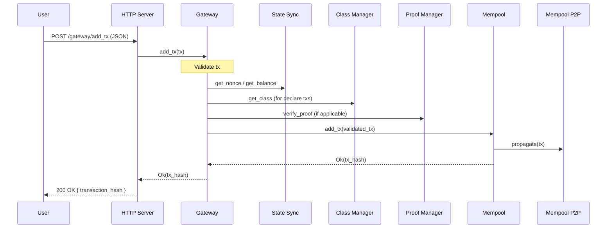
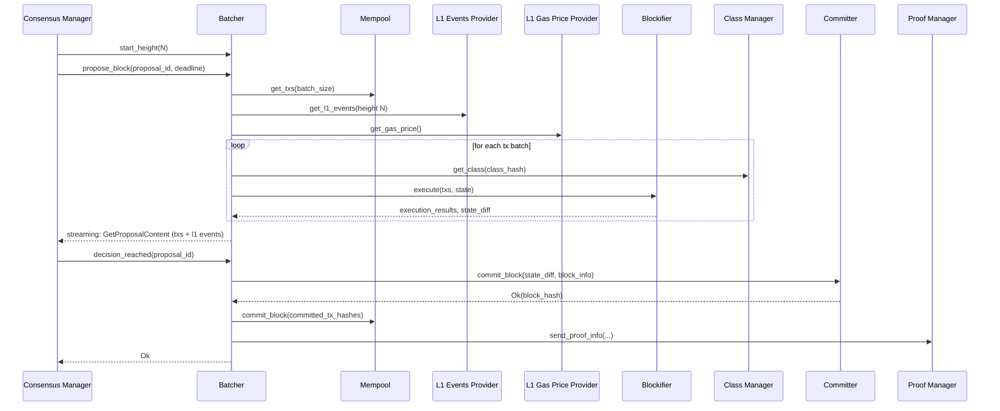
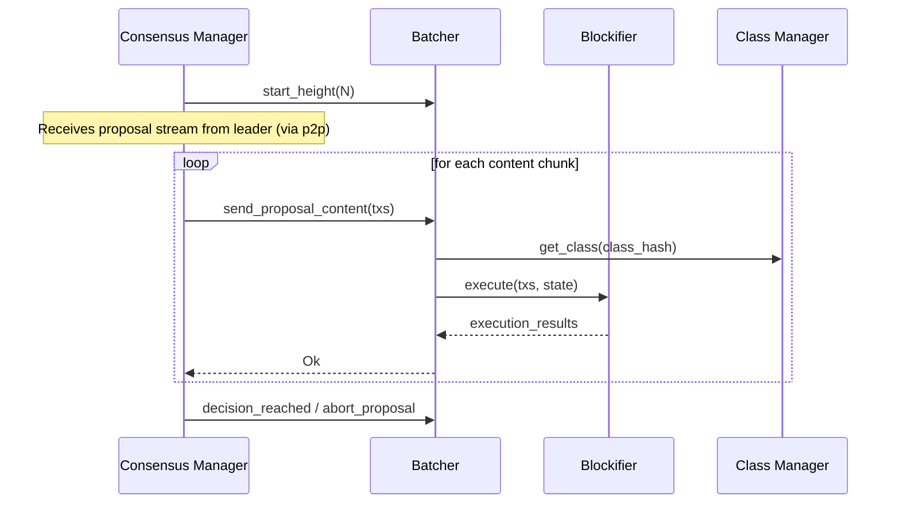
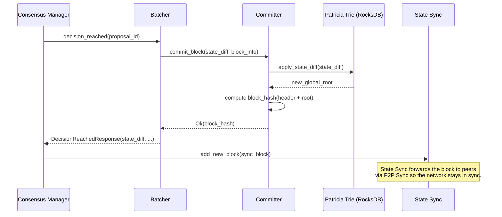
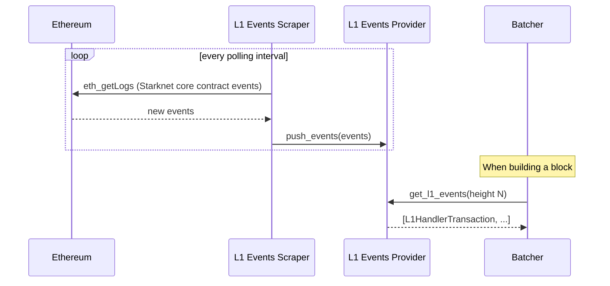

[↑ Index](README.md) | [← Prev: 03 — Component Reference](03-components.md)

---

# 04 — Key Data Flows

Step-by-step walkthroughs of the five key flows in the system.

---

## Flow 1: Transaction Submission

A user sends a `starknet_addInvokeTransaction` (or deploy / declare) via HTTP.



**Key validation steps in the Gateway:**
- Signature verification
- Nonce check (must be current or future, no replays)
- Fee/balance sufficiency
- Contract class existence (for invoke) / validity (for declare)

> For a detailed walkthrough of every stage — including Mempool internals, P2P propagation, Blockifier execution, and commit cleanup — see [05 — Transaction Lifecycle](deep-dives/05-transaction-lifecycle.md).

---

## Flow 2: Block Production (Happy Path)

The Consensus Manager drives the Batcher through a propose/commit cycle.



**Notes:**
- Consensus Manager calls `propose_block` on the leader and `send_proposal_content` + `validate_block` on validators.
- The Batcher streams content back to Consensus incrementally so validators can begin executing each chunk as it arrives, in parallel with the leader still building the rest. By the time the final chunk is sent, validators have already processed most of the block — reducing total time from proposal-start to decision.
- `decision_reached` is only called once 2/3+ of validators have accepted the proposal.

> For a detailed walkthrough of Tendermint rounds, proposer/validator roles, timeouts, abort, and sync fallback — see [06 — Block Production](deep-dives/06-block-production.md).

---

## Flow 3: Block Validation (Non-Leader)

When this sequencer is *not* the proposer, it validates a proposal from the leader.



---

## Flow 4: State Finalization

After `decision_reached`, two things happen in parallel: the Batcher commits the block to the Committer, and the Consensus Manager notifies State Sync.



**Why the Consensus Manager, not the Batcher?** The Consensus Manager's `finalize_decision` function assembles the `SyncBlock` directly from the `DecisionReachedResponse` it receives from the Batcher. This avoids an extra hop — the Consensus Manager already has all the data needed (state diff, transaction hashes, block header) to build the sync block without delegating back to the Batcher.

---

## Flow 5: L1 Event Ingestion

L1→L2 deposits and messages travel through:



---

## How Components Are Wired at Startup

When `apollo_node` starts, it runs four setup phases in order:

```
1. create_node_channels()   → allocates tokio mpsc channels for every local component pair
2. create_node_components() → creates each component object (passing clients for inter-component calls)
3. create_node_servers()    → wraps each component in a server (local, remote, or wrapper)
4. run_component_servers()  → spawns all servers as concurrent futures; panics if any exits
```

The clients passed into `create_node_components()` are built in `clients.rs` and abstract over whether the target is local (channel) or remote (HTTP). The component itself never knows which transport is in use.

---

## Check Your Understanding

> Relevant file: `architecture/04-data-flows.md`

1. In the block production flow, what is the purpose of the Batcher streaming content back to the Consensus Manager incrementally rather than returning a complete block?
2. In the startup wiring, components receive *clients* for their dependencies rather than direct references to the components themselves. Why does this matter for deployment topology?
3. What are the four startup phases in `apollo_node`, in order?
4. In the validation flow (non-leader), the Batcher re-executes the transactions. Why doesn't it just trust the leader's execution result?

---

[↑ Index](README.md) | [← Prev: 03 — Component Reference](03-components.md)
