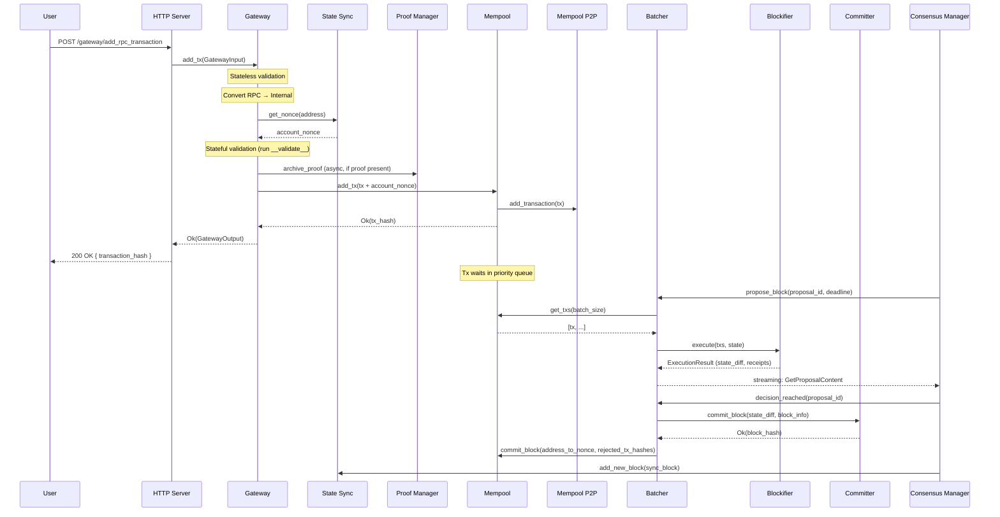

[↑ Index](../README.md) | [→ Next: 06 — Block Production](06-block-production.md)

---

# 05 — Transaction Lifecycle (Deep Dive)

From HTTP POST to committed block: a step-by-step walkthrough of every stage a transaction passes through, including the failure paths.

---

## Transaction Types

Apollo handles three kinds of user-submitted transactions:

| Type | What it does |
|------|-------------|
| **Invoke** | Call a function on an already-deployed contract |
| **Declare** | Register a new contract class (Sierra + CASM) on-chain |
| **DeployAccount** | Deploy a new account contract (e.g., a wallet) |

All three follow the same ingestion pipeline. Where they diverge is noted inline.

There is also a fourth type, **L1Handler**, but it is not submitted by users — it is sourced from Ethereum events by the L1 Events Scraper and injected by the Batcher directly. It is described briefly at the end.

---

## Full Lifecycle at a Glance

---

## Stage 1: HTTP Ingestion

**Crate:** [`crates/apollo_http_server/src/http_server.rs`](../../crates/apollo_http_server/src/http_server.rs)

The HTTP Server exposes two routes for transaction submission:

| Route | Handler | Notes |
|-------|---------|-------|
| `/gateway/add_rpc_transaction` | `add_rpc_tx` | Primary JSON-RPC endpoint |
| `/gateway/add_transaction` | `add_tx` | Legacy REST endpoint; converts format before forwarding |

Before forwarding to the Gateway, the HTTP Server performs lightweight pre-checks:

1. **Accept check** — reads `accept_new_txs` from the Config Manager's dynamic config; rejects immediately if disabled (e.g., during maintenance).
2. **Version check** — only V3 transactions are accepted; older formats return a deprecation error.
3. **Resource bounds check** — validates that the resource bound fields are present and non-zero.

Once these pass, the server wraps the transaction in a `GatewayInput { rpc_tx, message_metadata }` and calls the Gateway client. The `message_metadata` field is `None` for user-submitted transactions and non-`None` for transactions arriving from peers over P2P (the Mempool P2P Runner re-uses the same Gateway route for inbound peer transactions).

The Gateway call is spawned as a separate async task to avoid cancellation if the HTTP connection drops mid-flight.

---

## Stage 2: Gateway Validation

**Crate:** [`crates/apollo_gateway/src/gateway.rs`](../../crates/apollo_gateway/src/gateway.rs)

The Gateway runs a three-phase validation pipeline:

### Phase 1: Stateless Validation

Checks that can be performed without reading any chain state:

- **For Declare transactions**: checks whether declaring is currently blocked by config, and whether the sender is on the `authorized_declarer` allowlist (if configured).
- **Transaction structure**: resource bounds, calldata size, signature size, proof data sizes — all checked against configurable limits.
- **Declare-specific**: validates Sierra program size and that the declared class hash matches the program content.

### Phase 2: Conversion

The `RpcTransaction` (the user-facing API format) is converted to an `InternalRpcTransaction` (the internal representation). For transactions carrying a ZK proof, proof verification is performed in a parallel async task during this step.

### Phase 3: Stateful Validation

Requires reading chain state via the State Sync client:

1. **Nonce read** — `state_sync_client.get_nonce(address)` returns the account's current committed nonce.
2. **Nonce bound check** — the incoming transaction's nonce must be `>= account_nonce`. Transactions with a nonce that is already consumed (too old) are rejected.
3. **Gas price check** — `max_l2_gas_price` in the transaction must be `>=` the previous block's L2 gas price. This prevents transactions from being permanently unexecutable.
4. **`__validate__` execution** — the account contract's `__validate__` entry point is called via Blockifier. This is the on-chain, user-defined authorization logic (e.g., signature check for a standard wallet contract). A non-zero return value means validation failed.

On any failure, the Gateway returns a `GatewayError` with a Starknet-compatible error code and the transaction is dropped. No state is modified.

On success, the transaction is sent to the Mempool. If a proof was present, it is also archived to the Proof Manager asynchronously (with a 5-second timeout; failure here does not block the tx).

---

## Stage 3: Mempool Storage

**Crate:** [`crates/apollo_mempool/src/mempool.rs`](../../crates/apollo_mempool/src/mempool.rs)

The Mempool maintains several internal data structures:

| Structure | Purpose |
|-----------|---------|
| `TransactionPool` | Full transaction objects, indexed by hash and by account+nonce |
| `FeeTransactionQueue` | Ordering structure that determines which tx the Batcher gets next |
| `MempoolState` | Per-account nonce tracking: committed, staged (in-flight), and recent commit history |
| `AddTransactionQueue` | Temporary holding area for Declare transactions (see below) |

### Priority ordering

`FeeTransactionQueue` splits transactions into two sub-queues:

- **Priority queue** — transactions whose `max_l2_gas_price` is at or above the current threshold, ordered by **tip** (descending). Higher tip = served first.
- **Pending queue** — transactions below the threshold, ordered by `max_l2_gas_price` (descending). These will not be included until the threshold drops or the gas price rises.

Only **one transaction per account address** can be in the queue at a time. When the Batcher pulls a transaction from account A, the next eligible transaction from account A (nonce + 1) is automatically enqueued — if it exists in the pool.

### Nonce gap handling

A transaction can arrive out of order: e.g., nonce 5 arrives before nonce 4. The Mempool stores it in `TransactionPool` but does **not** put it in the queue until the gap is filled. An account with a gap is flagged as **evictable**: if the Mempool is full, its transactions are the first to be removed to make space.

### Fee escalation

If a transaction arrives for an account+nonce combination that already has a transaction in the pool, the Mempool can replace it — but only if both the tip and `max_l2_gas_price` are higher by at least `fee_escalation_percentage` (configurable). This prevents spam replacement attacks.

### Declare delay

Declare transactions are held in `AddTransactionQueue` for a configurable `declare_delay` duration before being promoted to the main pool. This gives the Sierra Compiler time to compile the class so it is ready by the time the Batcher attempts to execute the Declare.

### add_tx steps (simplified)

1. Reject duplicate (same tx hash already in pool).
2. Reject if nonce is too old (below committed nonce).
3. If same (account, nonce) exists: enforce fee escalation or reject.
4. For Declare: enter `AddTransactionQueue`; for others: enter `TransactionPool`.
5. If the nonce matches the account's next expected nonce: enqueue in `FeeTransactionQueue`.
6. Propagate to peers via `mempool_p2p_propagator_client.add_transaction(tx)`.
7. If pool is over capacity: evict transactions from accounts with nonce gaps.

---

## Stage 4: P2P Propagation

**Crate:** [`crates/apollo_mempool_p2p/src/propagator/mod.rs`](../../crates/apollo_mempool_p2p/src/propagator/mod.rs), [`runner/mod.rs`](../../crates/apollo_mempool_p2p/src/runner/mod.rs)

The Mempool P2P component has two sub-components:

**Propagator** (reactive, called by Mempool):
- Receives `add_transaction` calls and queues transactions for broadcast.
- When the queue reaches `max_transaction_batch_size`, or on a periodic flush, it broadcasts an `RpcTransactionBatch` to all connected peers via [libp2p](https://libp2p.io/).

**Runner** (active, its own loop):
- Listens for incoming `RpcTransactionBatch` messages from peers.
- Feeds each received transaction back through the Gateway (`add_tx` with `message_metadata` set to the peer's info).
- If the Gateway rejects a transaction, the peer that sent it is reported as misbehaving.
- Enforces backpressure: if more than `max_concurrent_gateway_requests` requests are already in flight, new inbound transactions are dropped.

This means that every transaction submitted to any sequencer eventually reaches all other sequencers, subject to the flood-fill propagation of the libp2p gossip network.

---

## Stage 5: Batcher Pull

**Crate:** [`crates/apollo_batcher/src/batcher.rs`](../../crates/apollo_batcher/src/batcher.rs)

When the Consensus Manager calls `propose_block`, the Batcher creates a `ProposeTransactionProvider` — an async source of transactions that pulls from two sources in sequence:

1. **Mempool transactions** (`get_txs(batch_size)`) — highest-tip first, up to `max_txs_per_mempool_request` at a time.
2. **L1 Handler transactions** (`get_l1_events(height)`) — deposits and messages from Ethereum, included up to `max_l1_handler_txs_per_block_proposal`.

The order of phases (Mempool first or L1 first) alternates based on a configurable cadence (`propose_l1_txs_every`), ensuring L1 messages are not indefinitely delayed by a full Mempool.

Once the Batcher calls `get_txs`, the Mempool **stages** those transactions: their nonces are tentatively advanced in `MempoolState.staged`, and the next tx for each account is enqueued. The transactions are not removed from the pool yet — they are still recoverable if the block is aborted.

---

## Stage 6: Blockifier Execution

**Crate:** [`crates/blockifier/src/transaction/`](../../crates/blockifier/src/transaction/)

The Batcher passes transactions to the `BlockBuilder`, which calls Blockifier to execute them. For each transaction:

1. **`__validate__`** — the account's on-chain validation function runs again (the Gateway already ran it off-chain, but the Blockifier re-runs it for correctness under the actual state at execution time).
2. **Fee deduction** — the actual fee (within the declared max) is deducted from the account's balance.
3. **Execution**:
   - **Invoke**: the target contract's function is called in the Cairo VM.
   - **Declare**: the class hash is recorded in state; no code runs beyond registration.
   - **DeployAccount**: a new contract is deployed and its constructor runs.
   - **L1Handler**: the contract's designated L1 handler entry point is called.
4. **State diff** — all storage writes, nonce increments, new class hashes, and newly deployed contracts are accumulated into a `ThinStateDiff`.

The `BlockBuilder` streams executed transactions back to the Consensus Manager incrementally as each batch completes (rather than waiting for the full block), enabling validators to begin checking in parallel.

**Execution failure:** if a transaction fails (e.g., assertion in contract, out of gas), it is added to `rejected_tx_hashes`. Its state changes are rolled back. The Batcher records the rejection but continues building the block with the remaining transactions.

---

## Stage 7: Commit and Cleanup

**Crates:** [`crates/apollo_committer/src/committer.rs`](../../crates/apollo_committer/src/committer.rs), [`crates/apollo_batcher/src/batcher.rs`](../../crates/apollo_batcher/src/batcher.rs)

Once the Consensus Manager reaches a 2/3+ quorum and calls `decision_reached`:

1. **Batcher → Committer**: `commit_block(state_diff, block_info)` — the Committer applies the state diff to the Patricia Merkle Trie (RocksDB) to produce the new global state root, computes the block hash, and stores it.

2. **Batcher → L1 Events Provider**: `commit_block(consumed_l1_handler_hashes, rejected_l1_handler_hashes, height)` — marks which L1 handler transactions were processed.

3. **Batcher → Mempool**: `commit_block(address_to_nonce, rejected_tx_hashes)` — the Mempool:
   - **Removes rejected transactions** from the pool.
   - **Advances committed nonces** for every account that had transactions in the block.
   - **Removes stale transactions** with nonces below the new committed nonce.
   - **Closes nonce gaps**: if a gap was filled by the committed block, the next queued transaction for that account is promoted.
   - **Rewinds** any accounts whose staged transactions were not included (e.g., if the block was smaller than expected).

4. **Consensus Manager → State Sync**: `add_new_block(sync_block)` — notifies State Sync so it can propagate the new block to peers.

---

## Failure Paths

| Stage | Failure | Result |
|-------|---------|--------|
| HTTP Server | `accept_new_txs` disabled | 503-style rejection, no gateway call |
| HTTP Server | Wrong version / missing fields | 400-style rejection |
| Gateway (stateless) | Oversized calldata, bad class hash, etc. | `GatewayError`, tx dropped |
| Gateway (stateful) | Nonce too old | `GatewayError`, tx dropped |
| Gateway (stateful) | `__validate__` returns non-zero | `GatewayError`, tx dropped |
| Mempool | Duplicate nonce, no fee escalation | Rejected, tx dropped |
| Mempool | Pool full, no evictable accounts | Rejected, tx dropped |
| Blockifier | Execution fails (assert, out of gas) | Tx marked rejected; nonce NOT advanced; removed from pool on commit |

---

## L1 Handler Transactions

L1 Handler transactions follow a different path:

- They are **not submitted by users** via HTTP.
- The L1 Events Scraper polls the Ethereum core contract and writes events to the L1 Events Provider.
- The Batcher reads them via `get_l1_events(height)` during block proposal.
- They skip the Gateway entirely — they are sourced from on-chain Ethereum events, which are already authenticated by Ethereum consensus.
- On execution failure, they are recorded as rejected and not retried (the L1 event is consumed regardless).

---

## Check Your Understanding

> Relevant file: `architecture/deep-dives/05-transaction-lifecycle.md`

1. A user submits an Invoke transaction with a nonce that is 2 ahead of the current committed nonce (i.e., there is a gap). The Gateway accepts it. What happens to it in the Mempool — will it be picked up by the Batcher immediately? Why or why not?
2. The `__validate__` entry point runs in the Gateway *and* again in the Blockifier. Why does it need to run twice?
3. What is the single condition that determines whether a transaction lands in the priority queue versus the pending queue? And separately, what condition must hold for a transaction to appear in *either* queue (as opposed to sitting in the pool waiting)?
4. After `decision_reached`, the Mempool receives `commit_block`. A transaction in the pool has nonce 7, but the committed nonce for that account is now 9. What happens to it?

---

[↑ Index](../README.md) | [→ Next: 06 — Block Production](06-block-production.md)