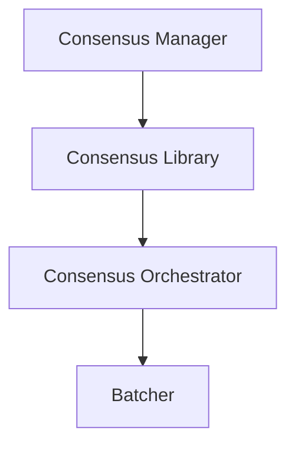
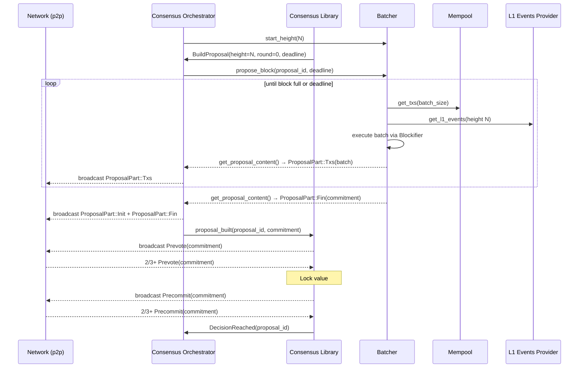
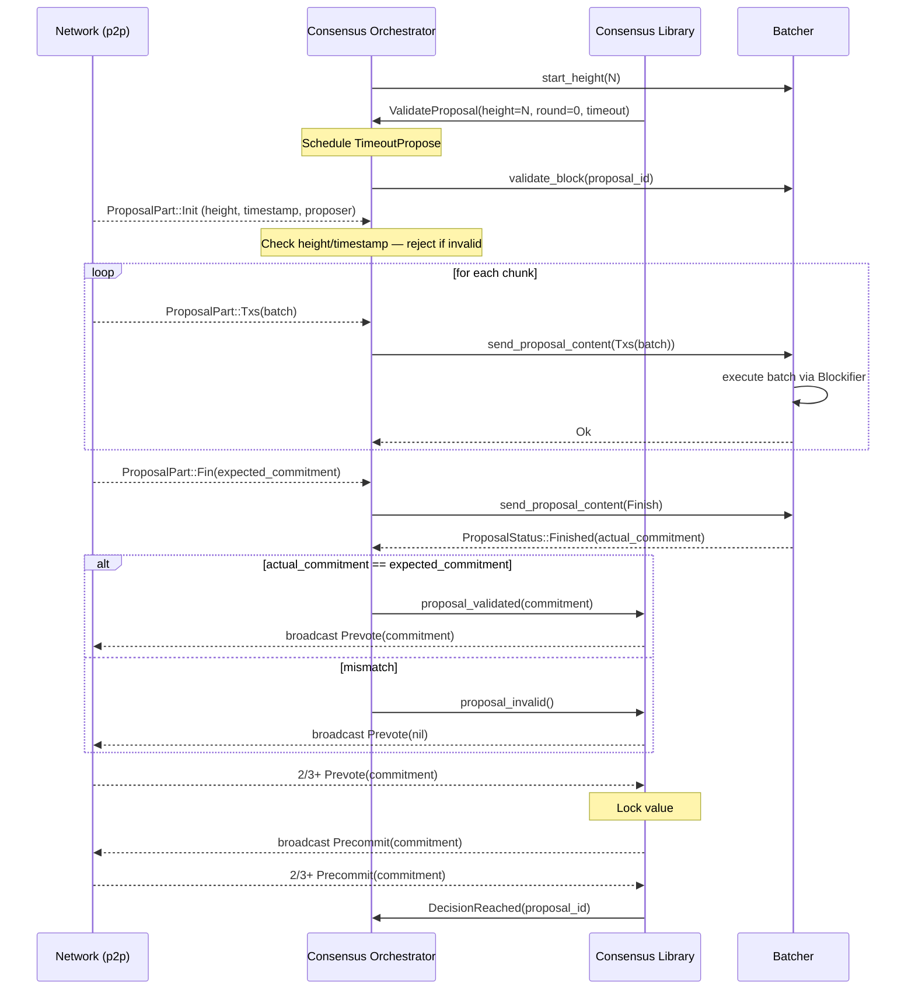
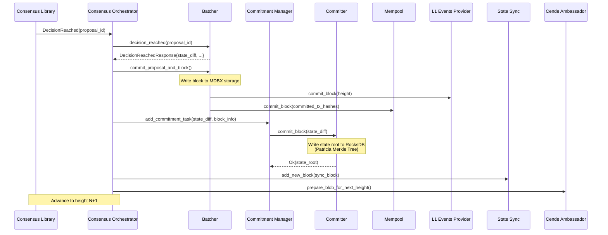

[↑ Index](../README.md) | [← Prev: 05 — Transaction Lifecycle](05-transaction-lifecycle.md) | [→ Next: 07 — Integration Tests](07-integration-tests.md)

---

# 06 — Block Production (Deep Dive)

From "new height" to "committed block": a detailed walkthrough of the Tendermint-based consensus loop, the proposer and validator roles, and the alternative paths (timeouts, abort, sync fallback, revert).

---

## The Four-Layer Architecture

Block production involves four distinct layers, each with a well-defined responsibility:

| Layer | Crate / struct | Role |
|-------|---------------|------|
| **Consensus Manager** | `apollo_consensus_manager` | Owns the network stack, spawns the Consensus Library task, connects to p2p layer |
| **Consensus Library** | `apollo_consensus` | Pure Tendermint state machine — tracks height, round, votes, locks; never touches the network or storage directly |
| **Consensus Orchestrator** | `ConsensusOrchestrator` | Translates Tendermint events (build, validate, decide, abort) into Batcher API calls; bridges the library's async events to batcher futures |
| **Batcher** | `apollo_batcher` | Calls Blockifier to build or validate a block; manages per-proposal streams; writes to storage on decision |

---

## Consensus Rounds: The Tendermint Loop

A **height** is a single block slot (e.g., block N). A **round** is an attempt within a height — a `u32` counter that starts at 0 and increments each time an attempt fails to reach a decision.

Each round has three steps:

| Step | What validators do |
|------|--------------------|
| **Propose** | The designated proposer broadcasts a block proposal (or nil). All others wait. |
| **Prevote** | Every validator independently broadcasts Prevote(value) or Prevote(nil). |
| **Precommit** | Every validator broadcasts Precommit(value) or Precommit(nil). |

**Proposer selection** is deterministic: `committee.get_actual_proposer(height, round)` rotates through the validator set. Both proposer and validators compute the same result without communication.

**The key safety invariant**: once 2/3+ validators prevote a value, that value is *locked* — no other value can be decided at this height. A proposer in a later round that already holds a lock must repropose the locked value, not build a fresh block.

---

## Happy Path: Proposer Role

**Batcher internals during proposal build:**
- A `ProposeTransactionProvider` pulls transactions from the Mempool (ordered by tip) and L1 events from the L1 Events Provider.
- A `BlockBuilder` feeds them into a `ConcurrentTransactionExecutor` backed by Blockifier.
- Results stream back to the Orchestrator via `get_proposal_content()` as `ProposalPart::Txs` chunks, then a final `ProposalPart::Fin` containing the state commitment.
- The `ProposalPart::Init` (block metadata: height, timestamp, proposer) is prepended by the Orchestrator before broadcasting.

---

## Happy Path: Validator Role

**Batcher internals during validation:**
- A `ValidateTransactionProvider` receives transaction batches from the Orchestrator via a bounded channel.
- A `BlockBuilder` re-executes each batch with Blockifier, producing a local state commitment.
- When `send_proposal_content(Finish)` arrives, the batcher signals `ProposalStatus::Finished(commitment)`.
- The Orchestrator compares this against the `Fin` commitment received from the network — a mismatch triggers prevote nil.

---

## Decision and Finalization

After `decision_reached`:
1. The Batcher returns the `state_diff` and block info, then commits the block to MDBX storage.
2. The Mempool receives `commit_block` to evict committed transactions and re-queue stale ones.
3. The L1 Events Provider marks L1 events at this height as consumed.
4. The Commitment Manager asynchronously computes the state root via the Committer (Patricia Merkle Tree in RocksDB).
5. State Sync receives the new block so it can serve it to lagging nodes.
6. The Cende Ambassador prepares the next-height blob for the L1 commitment.

---

## Alternative Paths

### Round Timeout

Three timeout types fire in sequence if quorum is not reached:

| Timeout | Fires when | Consequence |
|---------|-----------|-------------|
| **TimeoutPropose** | No proposal received within allotted time | Validator prevotes nil |
| **TimeoutPrevote** | 2/3+ votes received but not all value | Node precommits nil |
| **TimeoutPrecommit** | 2/3+ precommit votes but no quorum | Advance to round + 1 |

On round advance, the Orchestrator calls `interrupt_active_proposal()`, which cancels the in-flight build or validate future and calls `batcher.abort_proposal()`. A new proposer is computed for the new round via `committee.get_actual_proposer(height, round + 1)`.

---

### Reproposal (Locked Value)

If a node enters a new round as proposer but already holds a *locked* value from a prior round's prevote quorum, Tendermint safety requires it to **repropose that same value** — not build a fresh block.

The Orchestrator calls `repropose()`, which re-streams the cached `ProposalContent` from `valid_proposals` with updated round metadata. This guarantees that once 2/3+ validators have prevoted a block, only that block can be decided at this height — even across arbitrarily many round timeouts.

---

### Invalid Proposal / Abort

Validation can fail at several points:

- **Bad `ProposalInit`**: height or timestamp mismatch — rejected immediately before forwarding to the Batcher.
- **Batcher returns `Invalid`**: execution failure (e.g., block exceeds resource limits, bad state transition).
- **Commitment mismatch on `Fin`**: local re-execution produced a different state root than the proposer claimed.
- **Timeout**: `TimeoutPropose` fires before the full proposal stream arrives.

On any failure the Orchestrator calls `abort_proposal_send()`, which sends `send_proposal_content(Abort)` to the Batcher. The Batcher clears its streams and marks the proposal `Aborted`. The Consensus Library never receives a `FinishedValidation` event, eventually fires `TimeoutPropose`, and prevotes nil — advancing the round.

---

### Sync Fallback

If consensus stalls or the node is catching up after downtime, the Orchestrator calls `try_sync()` to check whether State Sync already holds the block at the current height.

On a sync hit:
1. `interrupt_active_proposal()` cancels any in-flight consensus work.
2. `batcher.add_sync_block(sync_block)` delivers a pre-executed `SyncBlock` (containing the state diff, not raw transactions).
3. The Batcher applies the state diff directly — no Blockifier execution.
4. The node advances to height N+1 without participating in consensus for that height.

This path ensures nodes that fall behind can catch up quickly without re-executing every block from scratch.

---

### Revert (Startup Only)

Revert is an operational emergency mechanism, not a consensus failure path. It is only triggered at startup and only when explicitly configured.

On startup, the Consensus Manager checks `RevertConfig`. If set, it calls `batcher.revert_block()` for each height from the current tip down to the configured target, unwinding storage in reverse order. After the revert loop completes, the component enters **eternal pending** — it will not resume processing until the node is restarted with the revert config cleared.

This exists to recover from catastrophic storage corruption, not for routine use.

---

## Resource Accounting: The Bouncer

Blockifier tracks two resource dimensions per block:

| Resource | What it measures | Why it matters |
|----------|-----------------|----------------|
| **`sierra_gas`** | Execution cost of Sierra VM instructions | Bounds CPU/memory per block |
| **`proving_gas`** | Cost of generating a ZK proof for the block | Ensures blocks are provable within hardware constraints |

When either limit is reached, `executor.is_done()` returns `true` and the block builder stops accepting transactions. The block closes at that point, even if time remains on the deadline.

This is the Batcher's "bouncer": no transaction can enter that would make the block unprovable or exceed execution bounds, regardless of how high its tip is.

---

## Check Your Understanding

> Relevant file: `architecture/deep-dives/06-block-production.md`

1. The proposer for height 10, round 0 is validator A. A's proposal stream is too slow and `TimeoutPropose` fires on all validators. Round advances to 1. Who is the new proposer, and how is it determined?
2. In round 1, the new proposer builds a block and 2/3+ validators send `Prevote(commitment_X)`. The round then times out before 2/3+ precommit. Round 2 begins and it is validator A's turn to propose again. What block must A propose, and why?
3. A validator receives a proposal where the `ProposalPart::Fin` commitment does not match the commitment it computed locally. Walk through what happens: what does the Orchestrator do, what does the Batcher do, and what vote does the Consensus Library eventually cast?
4. A node was offline for 50 blocks and comes back online. Describe the sync fallback path: which component detects the gap, what call is made to the Batcher, and what does the Batcher do differently compared to the normal validate path?

---

[↑ Index](../README.md) | [← Prev: 05 — Transaction Lifecycle](05-transaction-lifecycle.md) | [→ Next: 07 — Integration Tests](07-integration-tests.md)
