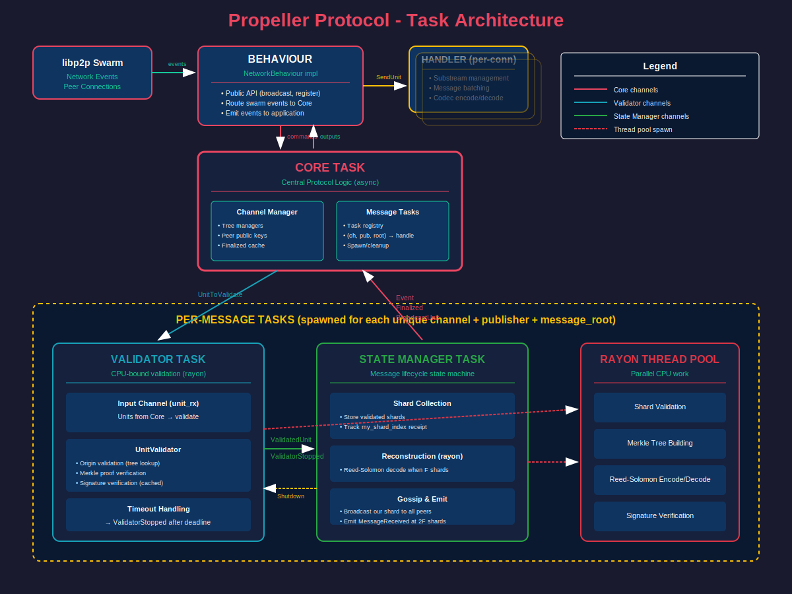

# Propeller Protocol - Complete Technical Documentation

This report is AI generated and may contain some errors...

## Table of Contents
1. [What is Propeller?](#what-is-propeller)
2. [Why Does Propeller Exist?](#why-does-propeller-exist)
3. [How Propeller Works](#how-propeller-works)
4. [Protocol Buffer Definition](#protocol-buffer-definition)
5. [Pseudo Code for Core Logic](#pseudo-code-for-core-logic)
6. [Implementation Architecture](#implementation-architecture)
7. [Task Structure Diagram](#task-structure-diagram)

---

## What is Propeller?

Propeller is a **tree-structured block dissemination protocol** for libp2p, inspired by Solana's Turbine protocol. It is designed to minimize publisher egress bandwidth while ensuring rapid and resilient block propagation across a high-throughput network.

### Core Concept

Instead of a publisher sending a complete message to every peer (which would consume enormous bandwidth), Propeller:
1. **Splits the message** into multiple shards using Reed-Solomon erasure coding
2. **Sends each shard to a different peer** in a single round
3. **Each peer gossips their shard** to all other peers
4. **Any peer can reconstruct the full message** once they receive enough shards

### Key Differences from Solana's Turbine

| Aspect | Turbine | Propeller |
|--------|---------|-----------|
| Shard Size | Many small shards | Fewer, larger shards |
| Transport | UDP/QUIC datagrams | Standard libp2p streams (TCP) |
| Topology | Multi-level tree | Flat peer mesh |
| Complexity | Higher | Lower (simplified) |

---

## Why Does Propeller Exist?

### Problem: Publisher Bandwidth Bottleneck

In a traditional broadcast model with N peers and message size M:
- Publisher must send M bytes to each of N-1 peers
- **Total publisher egress: M × (N-1)**

For a high-throughput blockchain:
- Block size: 1 MB
- Peers: 1000 nodes
- **Bandwidth required: ~1 GB per block!**

### Solution: Erasure-Coded Distribution

With Propeller:
- Publisher sends only ~M/F shards total (where F = fault tolerance)
- **Total publisher egress: ~M bytes** (regardless of network size!)

This is achieved through:
1. **Erasure Coding**: Split message into F data shards + (N-1-F) coding shards
2. **Distributed Forwarding**: Each peer receives one shard and forwards to all others
3. **Byzantine Tolerance**: Message can be reconstructed from any F shards

### Key Features

- **Dynamic Tree Topology**: Per-shard deterministic tree generation prevents targeted attacks
- **Weight-Based Selection**: Higher-stake nodes positioned closer to root for reliability
- **Reed-Solomon FEC**: Self-healing network with configurable fault tolerance
- **Attack Resistance**: Dynamic trees prevent adversaries from predicting and attacking specific paths

---

## How Propeller Works

### Mathematical Foundation

Given N total nodes in the network:
```
F = floor((N-1) / 3)    # Fault tolerance / Byzantine threshold
Data Shards = F          # Minimum shards needed to reconstruct
Coding Shards = N-1-F    # Redundancy shards
Total Shards = N-1       # Each non-publisher peer gets one shard
```

### Message Lifecycle

#### Phase 1: Publishing (at the Publisher)

```
1. PREPARE MESSAGE
   - Pad message to align with shard boundaries
   - Split into F data shards
   - Generate (N-1-F) coding shards using Reed-Solomon

2. CREATE MERKLE TREE
   - Hash all shards as leaves
   - Build tree to get Merkle Root
   - Generate proof for each shard

3. SIGN
   - Sign the Merkle Root with publisher's private key

4. BROADCAST
   - Create PropellerUnit for each shard
   - Send shard[i] to peer[i] (one shard per peer)
```

#### Phase 2: Validation (at Each Receiver)

```
1. VALIDATE ORIGIN
   - Check if sender is the expected broadcaster for this shard index
   - Prevent unauthorized forwarding

2. VALIDATE SIGNATURE
   - Verify publisher's signature over merkle_root
   - Cached after first verification per message

3. VALIDATE PROOF
   - Verify Merkle proof: hash(shard) + proof → merkle_root
   - Ensures shard integrity and membership

4. STORE & FORWARD
   - Store validated shard
   - Broadcast to all other peers (gossip phase)
```

#### Phase 3: Reconstruction (at Each Receiver)

```
1. CHECK THRESHOLD
   - If received_shards >= F (data shard count):
     - Begin reconstruction

2. RECONSTRUCT
   - Use Reed-Solomon decoder on available shards
   - Regenerate all data shards + coding shards

3. VERIFY
   - Rebuild Merkle tree from reconstructed shards
   - Verify computed root matches received merkle_root
   - If mismatch: publisher is malicious!

4. ACCESS CHECK
   - Wait until 2F shards received (gossip guarantee)
   - Only then deliver message to application

5. UN-PAD
   - Remove padding to recover original message
```

### Message Flow Diagram

```
Publisher P has message M to broadcast to peers [A, B, C, D]
(N=5 nodes, F=1 data shard, 3 coding shards)

                    ┌─────────────────────────────────────┐
                    │           PUBLISHER (P)             │
                    │                                     │
                    │  Message M                          │
                    │       ↓                             │
                    │  [Erasure Encode]                   │
                    │       ↓                             │
                    │  Shards: S0, S1, S2, S3            │
                    │       ↓                             │
                    │  [Build Merkle Tree]               │
                    │       ↓                             │
                    │  Root: R                            │
                    │       ↓                             │
                    │  [Sign R]                           │
                    │       ↓                             │
                    │  Signature: σ                       │
                    └──┬─────┬─────┬─────┬───────────────┘
                       │     │     │     │
        ┌──────────────┘     │     │     └──────────────┐
        │      ┌─────────────┘     └─────────────┐      │
        ↓      ↓                                 ↓      ↓
    ┌───────┐ ┌───────┐                     ┌───────┐ ┌───────┐
    │   A   │ │   B   │                     │   C   │ │   D   │
    │ (S0)  │ │ (S1)  │                     │ (S2)  │ │ (S3)  │
    └───┬───┘ └───┬───┘                     └───┬───┘ └───┬───┘
        │         │                             │         │
        │         │     ══════════════════      │         │
        │         │       GOSSIP PHASE          │         │
        │         │     ══════════════════      │         │
        │         │                             │         │
        └─────────┼──────────→ B,C,D ←──────────┼─────────┘
                  └──────────→ A,C,D ←──────────┘
                  
After gossip, each peer has enough shards to reconstruct M
```

---

## Protocol Buffer Definition

### propeller.proto

```protobuf
syntax = "proto3";
import "p2p/proto/common.proto";

// A Merkle proof consisting of sibling hashes used to verify leaf membership
message MerkleProof {
    repeated Hash256 siblings = 1;  // Ordered leaf-to-root
}

// A single unit containing an erasure-coded shard with cryptographic proofs
message PropellerUnit {
    bytes shard = 1;                 // The erasure-coded data fragment
    uint64 index = 2;                // Position in erasure coding scheme
    Hash256 merkle_root = 3;         // Root of all shards' Merkle tree
    MerkleProof merkle_proof = 4;    // Proof this shard belongs to tree
    PeerID publisher = 5;            // Original creator's peer ID
    bytes signature = 6;             // Publisher's signature over merkle_root
    uint32 channel = 7;              // Logical channel for multiplexing
}

// Batch for efficient network transmission
message PropellerUnitBatch {
    repeated PropellerUnit batch = 1;
}
```

### Field Descriptions

| Field | Type | Purpose |
|-------|------|---------|
| `shard` | bytes | The actual erasure-coded data fragment. Size = original_message_size / F where F is the data shard count. Can be a data shard (index < F) or coding shard (index >= F). |
| `index` | uint64 | Zero-based position of this shard. Indices 0 to F-1 are data shards; F to N-2 are coding shards. Used for erasure reconstruction and Merkle proof verification. |
| `merkle_root` | Hash256 | 32-byte SHA-256 hash root of the Merkle tree containing all shards. This is what the publisher signs. All units from the same message share this root. |
| `merkle_proof` | MerkleProof | List of sibling hashes needed to verify this shard's membership. verify(hash(shard), proof, index) = merkle_root |
| `publisher` | PeerID | The peer who originally created and signed this message. Used to look up public key for signature verification and determine expected sender. |
| `signature` | bytes | Ed25519 (or other) signature over "libp2p-propeller:" + merkle_root. Proves the publisher authorized this message. Cached after first verification. |
| `channel` | uint32 | Logical channel identifier for multiplexing. Allows multiple independent message streams on the same peer connection. |

### MerkleProof Details

The `siblings` array contains the sibling node hashes needed to reconstruct the path from leaf to root:
- `siblings[0]` = sibling at leaf level
- `siblings[k]` = sibling at level k
- Length = ceil(log2(total_shards))

Verification algorithm:
```
hash = SHA256("<leaf>" + shard + "</leaf>")
for i, sibling in enumerate(siblings):
    if (index >> i) & 1 == 0:
        hash = SHA256("<node><left>" + hash + "</left><right>" + sibling + "</right></node>")
    else:
        hash = SHA256("<node><left>" + sibling + "</left><right>" + hash + "</right></node>")
return hash == merkle_root
```

---

## Pseudo Code for Core Logic

### Broadcasting a Message (Publisher)

```python
def broadcast(channel: Channel, message: bytes) -> MessageRoot:
    # 1. Get network configuration
    tree_manager = channel_manager.get_tree(channel)
    num_nodes = tree_manager.node_count()
    F = max(1, (num_nodes - 1) // 3)  # Fault tolerance
    num_data_shards = F
    num_coding_shards = num_nodes - 1 - F
    
    # 2. Pad message to align with shards
    if config.pad:
        original_length = len(message)
        padding = 2 * num_data_shards - ((len(message) + 4) % (2 * num_data_shards))
        message = encode_u32_le(original_length) + message + zeros(padding)
    
    # 3. Split into data shards
    shard_size = len(message) // num_data_shards
    data_shards = [message[i:i+shard_size] for i in range(0, len(message), shard_size)]
    
    # 4. Generate coding shards (Reed-Solomon)
    coding_shards = reed_solomon_encode(data_shards, num_coding_shards)
    all_shards = data_shards + coding_shards
    
    # 5. Build Merkle tree
    merkle_tree = MerkleTree.new(all_shards)
    message_root = merkle_tree.root()
    
    # 6. Sign the merkle root
    signature = sign("libp2p-propeller:" + message_root, keypair)
    
    # 7. Create and send units
    peers = tree_manager.make_broadcast_list()  # [(peer, shard_index), ...]
    for peer, shard_index in peers:
        unit = PropellerUnit(
            channel=channel,
            publisher=local_peer_id,
            root=message_root,
            signature=signature,
            index=shard_index,
            shard=all_shards[shard_index],
            proof=merkle_tree.prove(shard_index)
        )
        send_to_peer(peer, unit)
    
    return message_root
```

### Handling Incoming Unit

```python
def handle_unit(sender: PeerId, unit: PropellerUnit):
    channel = unit.channel
    publisher = unit.publisher
    root = unit.root
    
    # 1. Check channel registration
    if not channel_manager.is_registered(channel):
        log.warn("Unregistered channel")
        return
    
    # 2. Check if already finalized
    if channel_manager.is_finalized(channel, publisher, root):
        log.trace("Already finalized")
        return
    
    # 3. Get or create message task
    message_key = (channel, publisher, root)
    if message_key not in message_tasks:
        # Spawn new validator and state manager tasks
        message_tasks[message_key] = spawn_message_tasks(
            channel, publisher, root,
            tree_manager=channel_manager.get_tree(channel)
        )
    
    # 4. Send to validator task
    message_tasks[message_key].validator_tx.send(UnitToValidate(sender, unit))
```

### Validator Task Logic

```python
async def run_validator_task(validator: UnitValidator, timeout: Duration):
    deadline = now() + timeout
    
    while True:
        select:
            case shutdown <- sm_to_validator_rx:
                break  # Clean shutdown
            
            case _ <- sleep_until(deadline):
                # Timeout - notify state manager
                state_manager_tx.send(ValidatorStopped)
                break
            
            case unit_to_validate <- unit_rx:
                sender, unit = unit_to_validate
                
                # Validate in thread pool (CPU-bound)
                result = await spawn_blocking:
                    validator.validate_shard(sender, unit)
                
                if result.is_ok():
                    state_manager_tx.send(ValidatedUnit(sender, unit))
                else:
                    log.trace(f"Validation failed: {result.error}")
```

### Shard Validation Logic

```python
def validate_shard(sender: PeerId, unit: PropellerUnit) -> Result:
    # 1. Check for duplicates
    if unit.index in received_indices:
        return Err(DuplicateShard)
    
    # 2. Validate origin (sender is expected broadcaster)
    expected_sender = tree_manager.get_peer_for_shard(publisher, unit.index)
    
    if expected_sender == local_peer_id:
        # We're the expected broadcaster, sender should be publisher
        if sender != publisher:
            return Err(UnexpectedSender(expected_sender, unit.index))
    else:
        # Sender should be the expected broadcaster (gossip)
        if sender != expected_sender:
            return Err(UnexpectedSender(expected_sender, unit.index))
    
    # 3. Validate Merkle proof
    leaf_hash = sha256("<leaf>" + unit.shard + "</leaf>")
    if not unit.proof.verify(unit.root, leaf_hash, unit.index):
        return Err(ProofVerificationFailed)
    
    # 4. Validate signature (cached after first verification)
    if validation_mode == Strict:
        if cached_signature is None:
            # First time - verify and cache
            if not verify_signature("libp2p-propeller:" + unit.root, 
                                   unit.signature, publisher_public_key):
                return Err(SignatureVerificationFailed)
            cached_signature = unit.signature
        else:
            # Subsequent - just compare
            if unit.signature != cached_signature:
                return Err(SignatureVerificationFailed)
    
    # 5. Mark as received
    received_indices.add(unit.index)
    
    return Ok(())
```

### State Manager Task Logic

```python
async def run_state_manager_task(my_shard_index: ShardIndex):
    received_shards = []
    received_count = 0
    received_my_index = False
    my_shard_broadcasted = False
    reconstructed_message = None
    
    while True:
        select:
            case msg <- validator_rx:
                match msg:
                    case ValidatedUnit(sender, unit):
                        received_count += 1
                        
                        if unit.index == my_shard_index:
                            received_my_index = True
                        
                        # Broadcast our shard when received
                        if unit.index == my_shard_index and not my_shard_broadcasted:
                            my_shard_broadcasted = True
                            broadcast_to_all_peers(unit)
                        
                        if reconstructed_message is None:
                            # Collecting phase
                            received_shards.append(unit)
                            
                            # Check reconstruction threshold
                            if tree_manager.should_build(received_count):
                                # Start reconstruction (in thread pool)
                                reconstructed = await reconstruct_message(
                                    received_shards, message_root,
                                    my_shard_index, data_count, coding_count
                                )
                                
                                if reconstructed.is_err():
                                    emit_event(ReconstructionFailed(reconstructed.error))
                                    finalize_and_exit()
                                
                                reconstructed_message = reconstructed.message
                                
                                # Broadcast reconstructed shard if needed
                                if not my_shard_broadcasted:
                                    my_shard_broadcasted = True
                                    broadcast_to_all_peers(reconstructed.my_shard)
                        
                        # Check access threshold
                        access_count = received_count + (0 if received_my_index else 1)
                        if reconstructed_message and tree_manager.should_receive(access_count):
                            emit_event(MessageReceived(publisher, root, reconstructed_message))
                            finalize_and_exit()
                    
                    case ValidatorStopped:
                        emit_event(MessageTimeout(channel, publisher, root))
                        finalize_and_exit()
            
            case result <- reconstruction_rx:
                # Handle async reconstruction result
                process_reconstruction_result(result)
```

### Message Reconstruction

```python
def reconstruct_message(shards: List[PropellerUnit], expected_root: MessageRoot,
                        my_shard_index: int, data_count: int, coding_count: int):
    # 1. Prepare shard data for decoder
    shard_data = [(shard.index, shard.data) for shard in shards]
    
    # 2. Reed-Solomon decode
    data_shards = reed_solomon_decode(shard_data, data_count, coding_count)
    
    # 3. Regenerate coding shards
    coding_shards = reed_solomon_encode(data_shards, coding_count)
    all_shards = data_shards + coding_shards
    
    # 4. Verify all shards have same length
    if not all(len(s) == len(all_shards[0]) for s in all_shards):
        return Err(UnequalShardLengths)
    
    # 5. Verify Merkle root matches
    merkle_tree = MerkleTree.new(all_shards)
    if merkle_tree.root() != expected_root:
        return Err(MismatchedMessageRoot)  # Publisher is malicious!
    
    # 6. Combine data shards
    message = concatenate(data_shards)
    
    # 7. Un-pad message
    if config.pad:
        original_length = decode_u32_le(message[0:4])
        message = message[4:4+original_length]
    
    # 8. Return message and our shard for broadcasting
    return Ok(ReconstructionSuccess(
        message=message,
        my_shard=all_shards[my_shard_index],
        my_shard_proof=merkle_tree.prove(my_shard_index)
    ))
```

---

## Implementation Architecture

### Module Structure

```
apollo_propeller/src/
├── lib.rs              # Public API exports
├── behaviour.rs        # libp2p NetworkBehaviour implementation
├── core.rs             # Protocol logic (Core struct)
├── config.rs           # Configuration types
├── handler.rs          # Per-connection message handler
├── protocol.rs         # libp2p protocol upgrade
├── codec.rs            # Prost-based wire format codec
├── unit.rs             # PropellerUnit type and serialization
├── unit_validator.rs   # Shard validation logic
├── tree.rs             # Tree topology computation
├── merkle.rs           # Merkle tree implementation
├── reed_solomon.rs     # Erasure coding functions
├── signature.rs        # Signing and verification
├── channel_utils.rs    # Async channel helpers
├── deadline_wrapper.rs # Task monitoring
├── metrics.rs          # Prometheus metrics
├── types.rs            # Core type definitions
└── tasks/
    ├── mod.rs
    ├── task_messages.rs      # Inter-task message types
    ├── validator_task.rs     # Per-message validation task
    └── state_manager_task.rs # Per-message state machine
```

### Component Responsibilities

| Component | Responsibility |
|-----------|----------------|
| `Behaviour` | libp2p integration, event routing, public API |
| `Core` | Central protocol logic, message routing, channel management |
| `Handler` | Per-connection substream management, batching |
| `ValidatorTask` | CPU-bound shard validation (one per message) |
| `StateManagerTask` | Message lifecycle state machine (one per message) |
| `PropellerTreeManager` | Compute peer→shard mapping deterministically |
| `UnitValidator` | Stateful validation (caches signatures, tracks received) |

### Channel Architecture

```
┌─────────────────────────────────────────────────────────────────────────────┐
│                              BEHAVIOUR                                       │
│  ┌─────────────────────────────────────────────────────────────────────┐   │
│  │                    core_commands_tx ────────►                       │   │
│  │                                                                     │   │
│  │  [libp2p Swarm] ◄──── core_outputs_rx ◄────────────────────────────│   │
│  └─────────────────────────────────────────────────────────────────────┘   │
└─────────────────────────────────────────────────────────────────────────────┘
                                    │
                                    ▼
┌─────────────────────────────────────────────────────────────────────────────┐
│                                CORE TASK                                     │
│                                                                              │
│  ┌──────────────────┐  ┌──────────────────────────────────────────────┐    │
│  │ commands_rx      │  │              Message Tasks Registry          │    │
│  │ (from Behaviour) │  │  ┌──────────────────────────────────────┐   │    │
│  └────────┬─────────┘  │  │  (channel, publisher, root) →        │   │    │
│           │            │  │     MessageTaskHandle {               │   │    │
│           ▼            │  │       validator_tx: Sender<Unit>      │   │    │
│  ┌────────────────┐   │  │     }                                  │   │    │
│  │ broadcaster_   │   │  └──────────────────────────────────────┘   │    │
│  │ results_rx     │   │                                              │    │
│  └────────────────┘   │  ┌──────────────────────────────────────┐   │    │
│           │            │  │ state_manager_rx (from all SM tasks) │   │    │
│           ▼            │  └──────────────────────────────────────┘   │    │
│  [Process Results]     │                                              │    │
│  [Route Messages]      │                                              │    │
└─────────────────────────────────────────────────────────────────────────────┘
                                    │
          ┌─────────────────────────┼─────────────────────────┐
          │                         │                         │
          ▼                         ▼                         ▼
┌─────────────────────┐  ┌─────────────────────┐  ┌─────────────────────┐
│ Message Task #1     │  │ Message Task #2     │  │ Message Task #N     │
│                     │  │                     │  │                     │
│ ┌─────────────────┐ │  │ ┌─────────────────┐ │  │ ┌─────────────────┐ │
│ │ VALIDATOR TASK  │ │  │ │ VALIDATOR TASK  │ │  │ │ VALIDATOR TASK  │ │
│ │                 │ │  │ │                 │ │  │ │                 │ │
│ │ unit_rx ◄───────│ │  │ │ unit_rx ◄───────│ │  │ │ unit_rx ◄───────│ │
│ │                 │ │  │ │                 │ │  │ │                 │ │
│ │  ▼ (validate)   │ │  │ │  ▼ (validate)   │ │  │ │  ▼ (validate)   │ │
│ │                 │ │  │ │                 │ │  │ │                 │ │
│ │ validator_to_sm │ │  │ │ validator_to_sm │ │  │ │ validator_to_sm │ │
│ │       ▼         │ │  │ │       ▼         │ │  │ │       ▼         │ │
│ └────────┬────────┘ │  │ └────────┬────────┘ │  │ └────────┬────────┘ │
│          │          │  │          │          │  │          │          │
│          ▼          │  │          ▼          │  │          ▼          │
│ ┌─────────────────┐ │  │ ┌─────────────────┐ │  │ ┌─────────────────┐ │
│ │ STATE MANAGER   │ │  │ │ STATE MANAGER   │ │  │ │ STATE MANAGER   │ │
│ │     TASK        │ │  │ │     TASK        │ │  │ │     TASK        │ │
│ │                 │ │  │ │                 │ │  │ │                 │ │
│ │ - Collect shards│ │  │ │ - Collect shards│ │  │ │ - Collect shards│ │
│ │ - Reconstruct   │ │  │ │ - Reconstruct   │ │  │ │ - Reconstruct   │ │
│ │ - Broadcast     │ │  │ │ - Broadcast     │ │  │ │ - Broadcast     │ │
│ │ - Emit events   │ │  │ │ - Emit events   │ │  │ │ - Emit events   │ │
│ │                 │ │  │ │                 │ │  │ │                 │ │
│ │ sm_to_core_tx ──┼─┼──┼─┼──────────────────┼─┼──┼─┼───────► Core   │ │
│ └─────────────────┘ │  │ └─────────────────┘ │  │ └─────────────────┘ │
└─────────────────────┘  └─────────────────────┘  └─────────────────────┘
```

---

## Task Structure Diagram



### Diagram Explanation

The diagram shows the complete task architecture of the Propeller protocol:

#### 1. **libp2p Swarm Layer**
- Handles network events and peer connections
- Routes events to the Behaviour

#### 2. **Behaviour (NetworkBehaviour impl)**
- Public API entry point (`broadcast()`, `register_channel_peers()`)
- Thin adapter that routes commands to Core task
- Receives outputs from Core and emits to application

#### 3. **Handler (per-connection)**
- One Handler per connected peer
- Manages libp2p substreams
- Batches PropellerUnits for efficient transmission
- Uses length-prefixed protobuf encoding

#### 4. **Core Task (Central)**
- Main protocol logic loop
- Maintains channel registry and tree managers
- Routes incoming units to message-specific tasks
- Spawns/cleans up per-message tasks

#### 5. **Per-Message Tasks**
For each unique `(channel, publisher, message_root)` tuple:

- **Validator Task**: 
  - Receives units from Core
  - Offloads CPU-bound validation to rayon thread pool
  - Sends validated units to State Manager
  - Has configurable timeout (default: 120s)

- **State Manager Task**:
  - Collects validated shards
  - Triggers reconstruction when threshold reached (F shards)
  - Broadcasts our shard to gossip network
  - Emits `MessageReceived` when access threshold met (2F shards)
  - Signals finalization back to Core

#### 6. **Rayon Thread Pool**
- Handles CPU-intensive operations in parallel:
  - Merkle proof verification
  - Signature verification
  - Reed-Solomon encoding/decoding
  - Merkle tree construction

### Data Flow Summary

```
1. INCOMING MESSAGE:
   libp2p → Handler → Behaviour → Core → Validator → StateManager → Core → Behaviour → App

2. OUTGOING BROADCAST:
   App → Behaviour → Core → (rayon: prepare units) → Core → Behaviour → Handler → libp2p

3. GOSSIP (after receiving our shard):
   StateManager → Core → Behaviour → Handler → (all peers)
```

---

## Configuration Options

| Option | Type | Default | Description |
|--------|------|---------|-------------|
| `finalized_message_ttl` | Duration | 120s | How long to cache finalized message IDs |
| `validation_mode` | Strict/None | Strict | Whether to verify signatures |
| `stream_protocol` | String | "/propeller/1.0.0" | libp2p protocol identifier |
| `max_wire_message_size` | usize | 1GB | Maximum batch size over wire |
| `pad` | bool | true | Whether to pad messages for alignment |
| `task_timeout` | Duration | 120s | Per-message task timeout |
| `channel_capacity` | usize | 4096 | Bounded channel capacity |

---

## Security Considerations

### Attack Prevention

1. **Shard Spoofing**: Prevented by Merkle proofs - each shard must have valid proof against signed root
2. **Signature Forgery**: Publisher signs merkle root; signature cached after first verification
3. **Replay Attacks**: Finalized messages cached with TTL; duplicates rejected
4. **Targeted Attacks**: Tree topology is deterministic but based on shard index, preventing prediction
5. **Origin Spoofing**: Sender validation ensures shards come from expected peer in tree

### Validation Checks

```
For each incoming PropellerUnit:
✓ Channel is registered
✓ Message not already finalized  
✓ Sender is expected broadcaster for this shard index
✓ Shard hash + Merkle proof verifies against merkle_root
✓ Publisher signature over merkle_root is valid (if Strict mode)
✓ No duplicate shard indices
```

### Reconstruction Verification

```
After Reed-Solomon reconstruction:
✓ All shards have equal length
✓ Recomputed Merkle root matches received merkle_root
✓ If mismatch: publisher is malicious (emit error, don't deliver)
```

---

## Metrics

Propeller exports Prometheus metrics for monitoring:

### Shard Metrics
- `shards_published` - Shards created by this node
- `shards_sent` - Total shards sent (including forwards)
- `shards_received` - Total shards received
- `shards_forwarded` - Shards forwarded to gossip peers
- `shard_bytes_sent` / `shard_bytes_received` - Bandwidth usage

### Validation Metrics
- `shards_validation_failed` (labeled by reason)
- `shards_send_failed` (labeled by reason)

### Reconstruction Metrics
- `messages_reconstructed` - Successfully reconstructed messages
- `messages_reconstruction_failed` - Failed reconstructions

### System Metrics
- `collection_lengths` - Sizes of internal queues/caches:
  - `events_queue` - Pending events to emit
  - `connected_peers` - Current peer connections
  - `active_processors` - Active per-message tasks
  - `finalized_messages` - Cached finalized message IDs
  - `registered_channels` - Number of channels

---

## Example Usage

```rust
use apollo_propeller::{Behaviour, Channel, Config, MessageAuthenticity};
use libp2p::identity::Keypair;
use libp2p::PeerId;

#[tokio::main]
async fn main() {
    // Create keypair and derive peer ID
    let local_keypair = Keypair::generate_ed25519();
    let local_peer_id = PeerId::from(local_keypair.public());
    
    // Create propeller behaviour with signing enabled
    let config = Config::new();
    let mut propeller = Behaviour::new(
        MessageAuthenticity::Signed(local_keypair),
        config
    );
    
    // Register a channel with peer weights
    // (Higher weight = higher priority in tree)
    let channel = Channel(0);
    let peers = vec![
        (local_peer_id, 1000),  // Must include self!
        (peer1, 800),
        (peer2, 600),
        (peer3, 400),
    ];
    propeller.register_channel_peers(channel, peers).await.unwrap();
    
    // Broadcast a message
    let message = b"Hello, Propeller!".to_vec();
    let message_root = propeller.broadcast(channel, message).await.unwrap();
    
    println!("Broadcast complete, root: {:?}", message_root);
    
    // Handle events in swarm loop...
    // Event::MessageReceived { publisher, message_root, message }
}
```

---

## Glossary

| Term | Definition |
|------|------------|
| **Channel** | Logical stream identifier for multiplexing |
| **Publisher** | Node that creates and signs a message |
| **Shard** | Fragment of erasure-coded message |
| **Data Shard** | Original message fragment (indices 0..F) |
| **Coding Shard** | Redundancy fragment (indices F..N-1) |
| **F** | Fault tolerance = floor((N-1)/3) |
| **N** | Total nodes in network |
| **MessageRoot** | Merkle root of all shards (32 bytes) |
| **PropellerUnit** | Wire format for single shard + proofs |
| **Build Threshold** | F shards needed to reconstruct |
| **Access Threshold** | 2F shards needed to deliver message |
| **Gossip** | Each peer broadcasts received shards to all |


