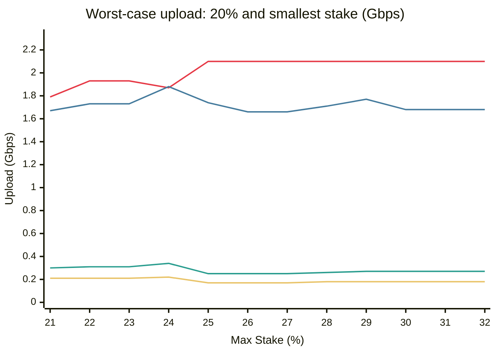
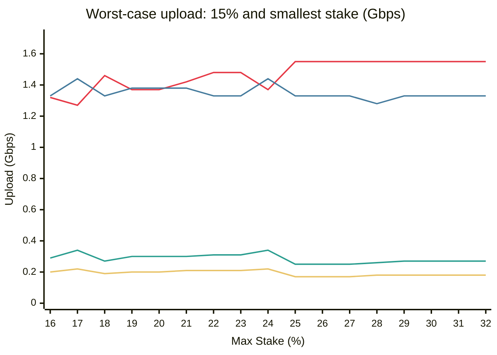
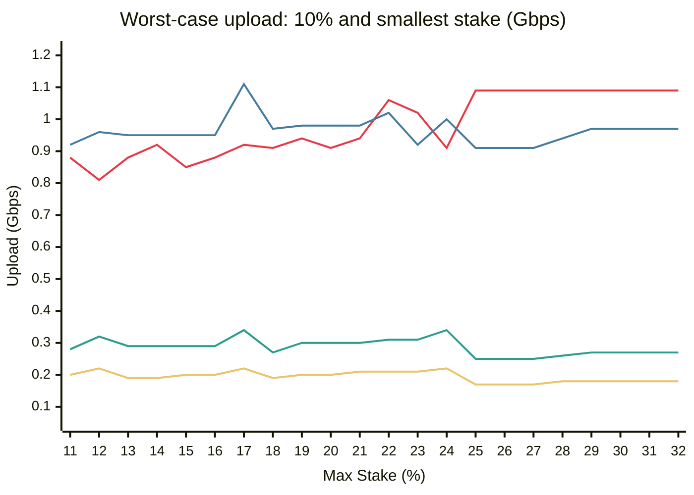
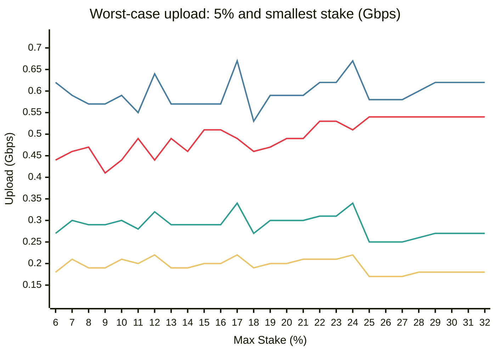

# Worst-case bandwidth sweep: N = 65, M = 5.0 MiB/s

For each stake pool and option, every distinct node is tried as publisher.
The row shows the publisher choice that maximises the peak upload from any node.

## max\_stake = 1.0%

Distribution: 1×2.08% + 64×1.53%

| Option | Expansion | Peak (MiB/s) | Peak (Gbps) | Pub upload | Max rcv | Worst publisher |
|---|--:|--:|--:|--:|--:|---|
| Option 1 (nodes) | 3.05× | 15.2 | 0.13 | 15.2 | 15.0 | pub=2.08% |
| Option 2 (excl fix) | 2.91× | 14.5 | 0.12 | 14.5 | 14.3 | pub=2.08% |
| Option 3 (excl prop) | 2.91× | 14.5 | 0.12 | 14.5 | 14.3 | pub=2.08% |
| Option 4 (pool fix) | 2.95× | 29.1 | 0.24 | 29.1 | 14.3 | pub=2.08% |
| Option 5 (pool prop) | 2.95× | 29.1 | 0.24 | 29.1 | 14.3 | pub=2.08% |

## max\_stake = 2.0%

Distribution: 49×2.00% + 1×1.85% + 15×0.01%

| Option | Expansion | Peak (MiB/s) | Peak (Gbps) | Pub upload | Max rcv | Worst publisher |
|---|--:|--:|--:|--:|--:|---|
| Option 1 (nodes) | 3.05× | 15.2 | 0.13 | 15.2 | 15.0 | pub=2.00% |
| Option 2 (excl fix) | 3.76× | 18.8 | 0.16 | 18.8 | 18.5 | pub=2.00% |
| Option 3 (excl prop) | 3.76× | 27.8 | 0.23 | 18.8 | 27.8 | pub=2.00% |
| Option 4 (pool fix) | 3.82× | 37.6 | 0.32 | 37.6 | 18.5 | pub=2.00% |
| Option 5 (pool prop) | 3.82× | 46.9 | 0.39 | 46.9 | 27.8 | pub=2.00% |

## max\_stake = 5.0%

Distribution: 19×5.00% + 1×4.55% + 45×0.01%

| Option | Expansion | Peak (MiB/s) | Peak (Gbps) | Pub upload | Max rcv | Worst publisher |
|---|--:|--:|--:|--:|--:|---|
| Option 1 (nodes) | 3.05× | 15.2 | 0.13 | 15.2 | 15.0 | pub=5.00% |
| Option 2 (excl fix) | 9.14× | 45.7 | 0.38 | 45.7 | 45.0 | pub=5.00% |
| Option 3 (excl prop) | 4.57× | 56.2 | 0.47 | 22.9 | 56.2 | pub=5.00% |
| Option 4 (pool fix) | 9.29× | 91.4 | 0.77 | 91.4 | 45.0 | pub=5.00% |
| Option 5 (pool prop) | 4.64× | 79.5 | 0.67 | 79.5 | 56.2 | pub=5.00% |

## max\_stake = 10.0%

Distribution: 9×10.00% + 1×9.45% + 55×0.01%

| Option | Expansion | Peak (MiB/s) | Peak (Gbps) | Pub upload | Max rcv | Worst publisher |
|---|--:|--:|--:|--:|--:|---|
| Option 1 (nodes) | 3.05× | 15.2 | 0.13 | 15.2 | 15.0 | pub=10.00% |
| Option 2 (excl fix) | 21.33× | 106.7 | 0.89 | 106.7 | 105.0 | pub=10.00% |
| Option 3 (excl prop) | 5.33× | 118.1 | 0.99 | 26.7 | 118.1 | pub=10.00% |
| Option 4 (pool fix) | 16.25× | 160.0 | 1.34 | 160.0 | 78.8 | pub=10.00% |
| Option 5 (pool prop) | 4.64× | 113.2 | 0.95 | 113.2 | 90.0 | pub=10.00% |

## max\_stake = 15.0%

Distribution: 6×15.00% + 56×0.17% + 3×0.16%

| Option | Expansion | Peak (MiB/s) | Peak (Gbps) | Pub upload | Max rcv | Worst publisher |
|---|--:|--:|--:|--:|--:|---|
| Option 1 (nodes) | 3.05× | 15.2 | 0.13 | 15.2 | 15.0 | pub=15.00% |
| Option 2 (excl fix) | 32.00× | 160.0 | 1.34 | 160.0 | 157.5 | pub=15.00% |
| Option 3 (excl prop) | 4.74× | 163.3 | 1.37 | 23.7 | 163.3 | pub=15.00% |
| Option 4 (pool fix) | 21.67× | 213.3 | 1.79 | 213.3 | 105.0 | pub=15.00% |
| Option 5 (pool prop) | 3.71× | 126.6 | 1.06 | 126.6 | 108.0 | pub=15.00% |

## max\_stake = 20.0%

Distribution: 4×20.00% + 1×19.40% + 60×0.01%

| Option | Expansion | Peak (MiB/s) | Peak (Gbps) | Pub upload | Max rcv | Worst publisher |
|---|--:|--:|--:|--:|--:|---|
| Option 1 (nodes) | 3.05× | 15.2 | 0.13 | 15.2 | 15.0 | pub=20.00% |
| Option 2 (excl fix) | 32.00× | 160.0 | 1.34 | 160.0 | 157.5 | pub=20.00% |
| Option 3 (excl prop) | 4.74× | 163.3 | 1.37 | 23.7 | 163.3 | pub=0.01% |
| Option 4 (pool fix) | 32.50× | 320.0 | 2.68 | 320.0 | 157.5 | pub=20.00% |
| Option 5 (pool prop) | 4.64× | 180.7 | 1.52 | 180.7 | 157.5 | pub=20.00% |

## max\_stake = 25.0%

Distribution: 3×25.00% + 1×24.39% + 61×0.01%

| Option | Expansion | Peak (MiB/s) | Peak (Gbps) | Pub upload | Max rcv | Worst publisher |
|---|--:|--:|--:|--:|--:|---|
| Option 1 (nodes) | 3.05× | 15.2 | 0.13 | 15.2 | 15.0 | pub=25.00% |
| Option 2 (excl fix) | 64.00× | 320.0 | 2.68 | 320.0 | 315.0 | pub=25.00% |
| Option 3 (excl prop) | 5.82× | 329.3 | 2.76 | 29.1 | 329.3 | pub=25.00% |
| Option 4 (pool fix) | 32.50× | 320.0 | 2.68 | 320.0 | 157.5 | pub=25.00% |
| Option 5 (pool prop) | 3.82× | 185.9 | 1.56 | 185.9 | 157.5 | pub=25.00% |

## max\_stake = 32.0%

Distribution: 3×32.00% + 28×0.07% + 34×0.06%

| Option | Expansion | Peak (MiB/s) | Peak (Gbps) | Pub upload | Max rcv | Worst publisher |
|---|--:|--:|--:|--:|--:|---|
| Option 1 (nodes) | 3.05× | 15.2 | 0.13 | 15.2 | 15.0 | pub=32.00% |
| Option 2 (excl fix) | 64.00× | 320.0 | 2.68 | 320.0 | 315.0 | pub=32.00% |
| Option 3 (excl prop) | 3.88× | 315.0 | 2.64 | 19.4 | 315.0 | pub=32.00% |
| Option 4 (pool fix) | 32.50× | 320.0 | 2.68 | 320.0 | 157.5 | pub=32.00% |
| Option 5 (pool prop) | 3.10× | 188.0 | 1.58 | 188.0 | 172.5 | pub=32.00% |

---

# Per-validator worst-case bandwidth: N = 65, M = 5.0 MiB/s

For each validator stake tier, shows the worst upload across ALL possible publishers.
This is the bandwidth each validator must provision.
Pool: \[max, max, ..., max, 20%, 15%, 10%, 5%, remainder\] (tiers < max\_stake only).

## max\_stake = 5.0%

Distribution: 19×5.00% + 40×0.11% + 6×0.10%

### Upload (MiB/s)

| Option | 5.00% (19) | 0.11% (40) | 0.10% (6) |
|---| --: | --: | --: |
| Opt 1 (nodes) | 15.2 | 15.2 | 15.2 |
| Opt 2 (excl fix) | 45.7 | 45.7 | 45.7 |
| Opt 3 (excl prop) | 56.2 | 22.9 | 22.9 |
| Opt 4 (pool fix) | 91.4 | 91.4 | 91.4 |
| Opt 5 (pool prop) | 79.5 | 34.5 | 34.5 |

### Upload (Gbps)

| Option | 5.00% (19) | 0.11% (40) | 0.10% (6) |
|---| --: | --: | --: |
| Opt 1 (nodes) | 0.13 | 0.13 | 0.13 |
| Opt 2 (excl fix) | 0.38 | 0.38 | 0.38 |
| Opt 3 (excl prop) | 0.47 | 0.19 | 0.19 |
| Opt 4 (pool fix) | 0.77 | 0.77 | 0.77 |
| Opt 5 (pool prop) | 0.67 | 0.29 | 0.29 |

## max\_stake = 10.0%

Distribution: 9×10.00% + 1×5.00% + 5×0.10% + 50×0.09%

### Upload (MiB/s)

| Option | 10.00% (9) | 5.00% (1) | 0.10% (5) | 0.09% (50) |
|---| --: | --: | --: | --: |
| Opt 1 (nodes) | 15.2 | 15.2 | 15.2 | 15.2 |
| Opt 2 (excl fix) | 106.7 | 105.0 | 105.0 | 105.0 |
| Opt 3 (excl prop) | 96.9 | 52.5 | 24.6 | 24.6 |
| Opt 4 (pool fix) | 160.0 | 160.0 | 160.0 | 160.0 |
| Opt 5 (pool prop) | 117.4 | 70.7 | 35.7 | 35.7 |

### Upload (Gbps)

| Option | 10.00% (9) | 5.00% (1) | 0.10% (5) | 0.09% (50) |
|---| --: | --: | --: | --: |
| Opt 1 (nodes) | 0.13 | 0.13 | 0.13 | 0.13 |
| Opt 2 (excl fix) | 0.89 | 0.88 | 0.88 | 0.88 |
| Opt 3 (excl prop) | 0.81 | 0.44 | 0.21 | 0.21 |
| Opt 4 (pool fix) | 1.34 | 1.34 | 1.34 | 1.34 |
| Opt 5 (pool prop) | 0.98 | 0.59 | 0.30 | 0.30 |

## max\_stake = 15.0%

Distribution: 5×15.00% + 1×10.00% + 1×5.00% + 14×0.18% + 44×0.17%

### Upload (MiB/s)

| Option | 15.00% (5) | 10.00% (1) | 5.00% (1) | 0.18% (14) | 0.17% (44) |
|---| --: | --: | --: | --: | --: |
| Opt 1 (nodes) | 15.2 | 15.2 | 15.2 | 15.2 | 15.2 |
| Opt 2 (excl fix) | 160.0 | 160.0 | 157.5 | 157.5 | 157.5 |
| Opt 3 (excl prop) | 157.5 | 101.2 | 60.6 | 23.7 | 23.7 |
| Opt 4 (pool fix) | 213.3 | 213.3 | 213.3 | 213.3 | 213.3 |
| Opt 5 (pool prop) | 158.2 | 113.2 | 68.2 | 34.5 | 34.5 |

### Upload (Gbps)

| Option | 15.00% (5) | 10.00% (1) | 5.00% (1) | 0.18% (14) | 0.17% (44) |
|---| --: | --: | --: | --: | --: |
| Opt 1 (nodes) | 0.13 | 0.13 | 0.13 | 0.13 | 0.13 |
| Opt 2 (excl fix) | 1.34 | 1.34 | 1.32 | 1.32 | 1.32 |
| Opt 3 (excl prop) | 1.32 | 0.85 | 0.51 | 0.20 | 0.20 |
| Opt 4 (pool fix) | 1.79 | 1.79 | 1.79 | 1.79 | 1.79 |
| Opt 5 (pool prop) | 1.33 | 0.95 | 0.57 | 0.29 | 0.29 |

## max\_stake = 20.0%

Distribution: 3×20.00% + 1×15.00% + 1×10.00% + 1×5.00% + 56×0.17% + 3×0.16%

### Upload (MiB/s)

| Option | 20.00% (3) | 15.00% (1) | 10.00% (1) | 5.00% (1) | 0.17% (56) | 0.16% (3) |
|---| --: | --: | --: | --: | --: | --: |
| Opt 1 (nodes) | 15.2 | 15.2 | 15.2 | 15.2 | 15.2 | 15.2 |
| Opt 2 (excl fix) | 160.0 | 160.0 | 160.0 | 160.0 | 160.0 | 160.0 |
| Opt 3 (excl prop) | 221.7 | 162.9 | 108.6 | 58.3 | 23.7 | 23.7 |
| Opt 4 (pool fix) | 320.0 | 320.0 | 320.0 | 320.0 | 320.0 | 320.0 |
| Opt 5 (pool prop) | 210.7 | 164.1 | 117.4 | 70.7 | 35.7 | 35.7 |

### Upload (Gbps)

| Option | 20.00% (3) | 15.00% (1) | 10.00% (1) | 5.00% (1) | 0.17% (56) | 0.16% (3) |
|---| --: | --: | --: | --: | --: | --: |
| Opt 1 (nodes) | 0.13 | 0.13 | 0.13 | 0.13 | 0.13 | 0.13 |
| Opt 2 (excl fix) | 1.34 | 1.34 | 1.34 | 1.34 | 1.34 | 1.34 |
| Opt 3 (excl prop) | 1.86 | 1.37 | 0.91 | 0.49 | 0.20 | 0.20 |
| Opt 4 (pool fix) | 2.68 | 2.68 | 2.68 | 2.68 | 2.68 | 2.68 |
| Opt 5 (pool prop) | 1.77 | 1.38 | 0.98 | 0.59 | 0.30 | 0.30 |

## max\_stake = 25.0%

Distribution: 1×25.00% + 1×20.00% + 1×15.00% + 1×10.00% + 1×5.00% + 40×0.42% + 20×0.41%

### Upload (MiB/s)

| Option | 25.00% (1) | 20.00% (1) | 15.00% (1) | 10.00% (1) | 5.00% (1) | 0.42% (40) | 0.41% (20) |
|---| --: | --: | --: | --: | --: | --: | --: |
| Opt 1 (nodes) | 15.2 | 15.2 | 15.2 | 15.2 | 15.2 | 15.2 | 15.2 |
| Opt 2 (excl fix) | 160.0 | 160.0 | 160.0 | 160.0 | 160.0 | 160.0 | 160.0 |
| Opt 3 (excl prop) | 279.0 | 250.1 | 185.3 | 129.7 | 64.9 | 20.0 | 20.0 |
| Opt 4 (pool fix) | 320.0 | 320.0 | 320.0 | 320.0 | 320.0 | 320.0 | 320.0 |
| Opt 5 (pool prop) | 246.7 | 207.3 | 158.1 | 108.9 | 69.5 | 30.2 | 30.2 |

### Upload (Gbps)

| Option | 25.00% (1) | 20.00% (1) | 15.00% (1) | 10.00% (1) | 5.00% (1) | 0.42% (40) | 0.41% (20) |
|---| --: | --: | --: | --: | --: | --: | --: |
| Opt 1 (nodes) | 0.13 | 0.13 | 0.13 | 0.13 | 0.13 | 0.13 | 0.13 |
| Opt 2 (excl fix) | 1.34 | 1.34 | 1.34 | 1.34 | 1.34 | 1.34 | 1.34 |
| Opt 3 (excl prop) | 2.34 | 2.10 | 1.55 | 1.09 | 0.54 | 0.17 | 0.17 |
| Opt 4 (pool fix) | 2.68 | 2.68 | 2.68 | 2.68 | 2.68 | 2.68 | 2.68 |
| Opt 5 (pool prop) | 2.07 | 1.74 | 1.33 | 0.91 | 0.58 | 0.25 | 0.25 |

## max\_stake = 32.0%

Distribution: 1×32.00% + 1×20.00% + 1×15.00% + 1×10.00% + 1×5.00% + 60×0.30%

### Upload (MiB/s)

| Option | 32.00% (1) | 20.00% (1) | 15.00% (1) | 10.00% (1) | 5.00% (1) | 0.30% (60) |
|---| --: | --: | --: | --: | --: | --: |
| Opt 1 (nodes) | 15.2 | 15.2 | 15.2 | 15.2 | 15.2 | 15.2 |
| Opt 2 (excl fix) | 315.0 | 320.0 | 320.0 | 320.0 | 320.0 | 315.0 |
| Opt 3 (excl prop) | 346.5 | 250.1 | 185.3 | 129.7 | 64.9 | 21.3 |
| Opt 4 (pool fix) | 320.0 | 320.0 | 320.0 | 320.0 | 320.0 | 320.0 |
| Opt 5 (pool prop) | 294.7 | 200.2 | 158.2 | 116.2 | 74.2 | 32.2 |

### Upload (Gbps)

| Option | 32.00% (1) | 20.00% (1) | 15.00% (1) | 10.00% (1) | 5.00% (1) | 0.30% (60) |
|---| --: | --: | --: | --: | --: | --: |
| Opt 1 (nodes) | 0.13 | 0.13 | 0.13 | 0.13 | 0.13 | 0.13 |
| Opt 2 (excl fix) | 2.64 | 2.68 | 2.68 | 2.68 | 2.68 | 2.64 |
| Opt 3 (excl prop) | 2.91 | 2.10 | 1.55 | 1.09 | 0.54 | 0.18 |
| Opt 4 (pool fix) | 2.68 | 2.68 | 2.68 | 2.68 | 2.68 | 2.68 |
| Opt 5 (pool prop) | 2.47 | 1.68 | 1.33 | 0.97 | 0.62 | 0.27 |

---

## Option 3 vs Option 5: N = 65, M = 5.0 MiB/s

Ratio = Opt\_3 upload / Opt\_5 upload. Values **> 1** mean Option 3 needs more bandwidth; **< 1** means Option 5 needs more.

### Max stake = 5%

| Tier (stake, count) | Opt 3 MiB/s | Opt 5 MiB/s | Ratio |
| :-- | --: | --: | --: |
| 5.00% (19) | 56.2 | 79.5 | 0.71 |
| 0.11% (40) | 22.9 | 34.5 | 0.66 |
| 0.10% (6) | 22.9 | 34.5 | 0.66 |

### Max stake = 10%

| Tier (stake, count) | Opt 3 MiB/s | Opt 5 MiB/s | Ratio |
| :-- | --: | --: | --: |
| 10.00% (9) | 96.9 | 117.4 | 0.83 |
| 5.00% (1) | 52.5 | 70.7 | 0.74 |
| 0.10% (5) | 24.6 | 35.7 | 0.69 |
| 0.09% (50) | 24.6 | 35.7 | 0.69 |

### Max stake = 15%

| Tier (stake, count) | Opt 3 MiB/s | Opt 5 MiB/s | Ratio |
| :-- | --: | --: | --: |
| 15.00% (5) | 157.5 | 158.2 | 1.00 |
| 10.00% (1) | 101.2 | 113.2 | 0.89 |
| 5.00% (1) | 60.6 | 68.2 | 0.89 |
| 0.18% (14) | 23.7 | 34.5 | 0.69 |
| 0.17% (44) | 23.7 | 34.5 | 0.69 |

### Max stake = 20%

| Tier (stake, count) | Opt 3 MiB/s | Opt 5 MiB/s | Ratio |
| :-- | --: | --: | --: |
| 20.00% (3) | 221.7 | 210.7 | 1.05 |
| 15.00% (1) | 162.9 | 164.1 | 0.99 |
| 10.00% (1) | 108.6 | 117.4 | 0.93 |
| 5.00% (1) | 58.3 | 70.7 | 0.82 |
| 0.17% (56) | 23.7 | 35.7 | 0.66 |
| 0.16% (3) | 23.7 | 35.7 | 0.66 |

### Max stake = 25%

| Tier (stake, count) | Opt 3 MiB/s | Opt 5 MiB/s | Ratio |
| :-- | --: | --: | --: |
| 25.00% (1) | 279.0 | 246.7 | 1.13 |
| 20.00% (1) | 250.1 | 207.3 | 1.21 |
| 15.00% (1) | 185.3 | 158.1 | 1.17 |
| 10.00% (1) | 129.7 | 108.9 | 1.19 |
| 5.00% (1) | 64.9 | 69.5 | 0.93 |
| 0.42% (40) | 20.0 | 30.2 | 0.66 |
| 0.41% (20) | 20.0 | 30.2 | 0.66 |

### Max stake = 32%

| Tier (stake, count) | Opt 3 MiB/s | Opt 5 MiB/s | Ratio |
| :-- | --: | --: | --: |
| 32.00% (1) | 346.5 | 294.7 | 1.18 |
| 20.00% (1) | 250.1 | 200.2 | 1.25 |
| 15.00% (1) | 185.3 | 158.2 | 1.17 |
| 10.00% (1) | 129.7 | 116.2 | 1.12 |
| 5.00% (1) | 64.9 | 74.2 | 0.87 |
| 0.30% (60) | 21.3 | 32.2 | 0.66 |

### Ratio summary (chart data)

| Max stake | 5% stake | 10% stake | 15% stake | 20% stake | smallest |
| --: | --: | --: | --: | --: | --: |
| 5% | 0.71 | - | - | - | 0.66 |
| 10% | 0.74 | 0.83 | - | - | 0.69 |
| 15% | 0.89 | 0.89 | 1.00 | - | 0.69 |
| 20% | 0.82 | 0.93 | 0.99 | 1.05 | 0.66 |
| 25% | 0.93 | 1.19 | 1.17 | 1.21 | 0.66 |
| 32% | 0.87 | 1.12 | 1.17 | 1.25 | 0.66 |

### Bandwidth charts (Gbps)

> Each chart shows worst-case upload in Gbps for a given stake tier.
> Two lines per option: the tracked tier and the smallest-stake tier.

**20% stake tier** (max stake 21%–32%):

| Color | Series |
|:---:|:---|
| $\color{#E63946}\textsf{\textbf{━━━}}$ | Opt 3 20% stake |
| $\color{#457B9D}\textsf{\textbf{━━━}}$ | Opt 5 20% stake |
| $\color{#E9C46A}\textsf{\textbf{━━━}}$ | Opt 3 smallest stake |
| $\color{#2A9D8F}\textsf{\textbf{━━━}}$ | Opt 5 smallest stake |

**15% stake tier** (max stake 16%–32%):

| Color | Series |
|:---:|:---|
| $\color{#E63946}\textsf{\textbf{━━━}}$ | Opt 3 15% stake |
| $\color{#457B9D}\textsf{\textbf{━━━}}$ | Opt 5 15% stake |
| $\color{#E9C46A}\textsf{\textbf{━━━}}$ | Opt 3 smallest stake |
| $\color{#2A9D8F}\textsf{\textbf{━━━}}$ | Opt 5 smallest stake |

**10% stake tier** (max stake 11%–32%):

| Color | Series |
|:---:|:---|
| $\color{#E63946}\textsf{\textbf{━━━}}$ | Opt 3 10% stake |
| $\color{#457B9D}\textsf{\textbf{━━━}}$ | Opt 5 10% stake |
| $\color{#E9C46A}\textsf{\textbf{━━━}}$ | Opt 3 smallest stake |
| $\color{#2A9D8F}\textsf{\textbf{━━━}}$ | Opt 5 smallest stake |

**5% stake tier** (max stake 6%–32%):

| Color | Series |
|:---:|:---|
| $\color{#E63946}\textsf{\textbf{━━━}}$ | Opt 3 5% stake |
| $\color{#457B9D}\textsf{\textbf{━━━}}$ | Opt 5 5% stake |
| $\color{#E9C46A}\textsf{\textbf{━━━}}$ | Opt 3 smallest stake |
| $\color{#2A9D8F}\textsf{\textbf{━━━}}$ | Opt 5 smallest stake |
