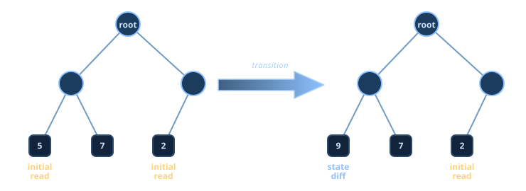
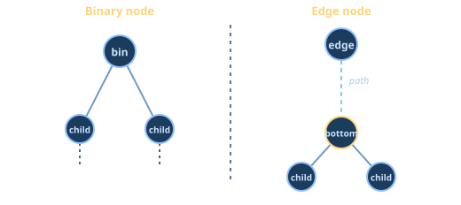
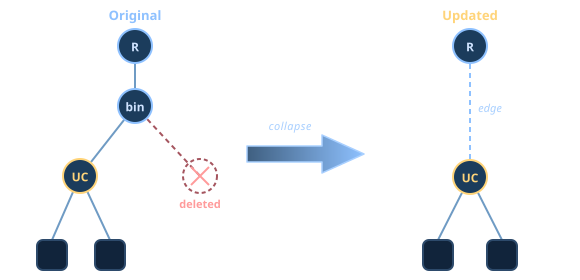

<!-- _class: lead invert -->

# **Commit and Fetch Witnesses**

## Core Committer Logic · Design Review

---

## Committing a state diff

  

    
1 · Fetch nodes

    
original root → W leaves

  

  
↓

  

    
2 · Updated tree

    
determine structure and fill hashes

  

  
↓

  

    
3 · Write to storage

    
persist the updated forest

  

IO &nbsp;·&nbsp; CPU

This is the current committer flow.

---

## Recap: What the OS needs?

The **prev** state, the **new** state, and the **transition** between them.

 

A state is:
- **root hash**
- **leaves** (initial reads / state diff)
- **witnesses** - authentication pathes against the root

---

## Basic suggestion - Fetch witnesses twice

  

    
Fetch witnesses

    
original root → R/W leaves

  

  
↓

  

    
1 · Fetch nodes

    
original root → W leaves

  

  
↓

  

    
2 · Updated tree

    
determine structure and fill hashes

  

  
↓

  

    
Fetch witnesses

    
updated root → R/W leaves

  

  
↓

  

    
3 · Write to storage

    
persist the updated forest

  

IO &nbsp;·&nbsp; CPU

---

## Agenda

- First fetch optimizations.
- Second fetch optimizations.

---

## First fetch optimization (1) - concurrency

  

    
1 · Fetch nodes

    
original root → W leaves

  

  
↓

  

    

    
2 · Updated tree

    
determine structure and fill hashes

  

    

    
Fetch witnesses

    
original root → R/W leaves

  

  

  
↓

  

    
Fetch witnesses

    
updated root → leaves

  

  
↓

  

    
3 · Write to storage

    
persist the updated forest

  

IO &nbsp;·&nbsp; CPU

The benchmarks were run on this version.

The W nodes are already in the cache.

---

## Fetching rules

- **Binary node** — collect both children, and keep collecting its touched children.
- **Edge node** — collect its bottom with the bottom's children, and keep fetching the bottom if it's touched.

---

## First fetch optimization (2) - a single scan

  

    
1 · Fetch nodes and witnesses

    
original root → R/W leaves

  

  
↓

  

    
2 · Updated tree

    
determine structure and fill hashes

  

  
↓

  

    
Fetch witnesses

    
updated root → leaves

  

  
↓

  

    
3 · Write to storage

    
persist the updated forest

  

A complex code change - merging two scanning logics.

Delaying the start of the hash calculation.

---

## First fetch optimization (3) - combined

  

    
1 · Fetch nodes and witnesses

    
original root → W leaves

  

  
↓

  

    

    
2 · Updated tree

    
determine structure and fill hashes

  

    

    
Fetch witnesses

    
original root → R leaves

  

  

  
↓

  

    
Fetch witnesses

    
updated root → leaves

  

  
↓

  

    
3 · Write to storage

    
persist the updated forest

  

Suggestion: implement if there is a performance requirement.

---

## Second fetch optimization - invalid

  

    
1 · Fetch nodes and witnesses

    
original root → R/W leaves

  

  
↓

  

    
2 · Updated tree

    
determine structure and fill hashes

  

  
↓

  

    
Collect updated nodes

    
fetch the nodes from step 2

  

  
↓

  

    
3 · Write to storage

    
persist the updated forest

  

---

## Edge case

- **UC** is an unchanged binary node.
- The OS proves that the new edge **R → UC** forms a valid Patricia structure, so **UC** is not an edge node.
- The children of **UC** are not fetched when the tree is updated.

---

## Second fetch optimization - collect the edge-case nodes

  

    
1 · Fetch nodes and witnesses

    
original root → R/W leaves

  

  
↓

  

    
2 · Updated tree

    
determine structure and fill hashes

  

  
↓

  

    
Fetch edge-case nodes

    
preimage of unchanged binary nodes with a deleted binary parent

  

  
↓

  

    
Collect updated nodes

    
fetch the nodes from step 2

  

  
↓

  

    
3 · Write to storage

    
persist the updated forest

  

The change is feasible but the improvement is limited, as most of the nodes are cached.

