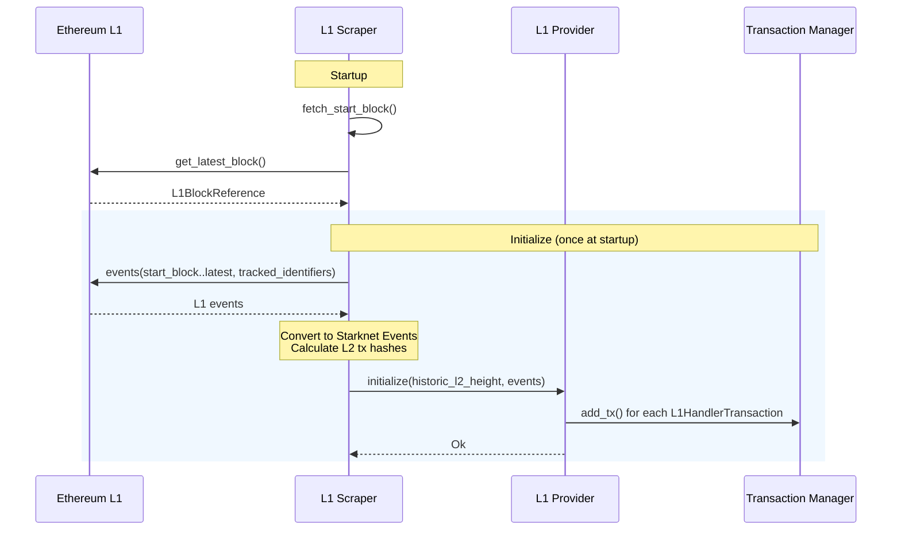
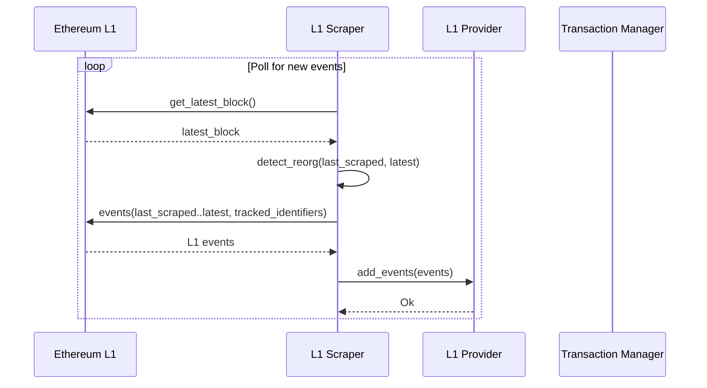
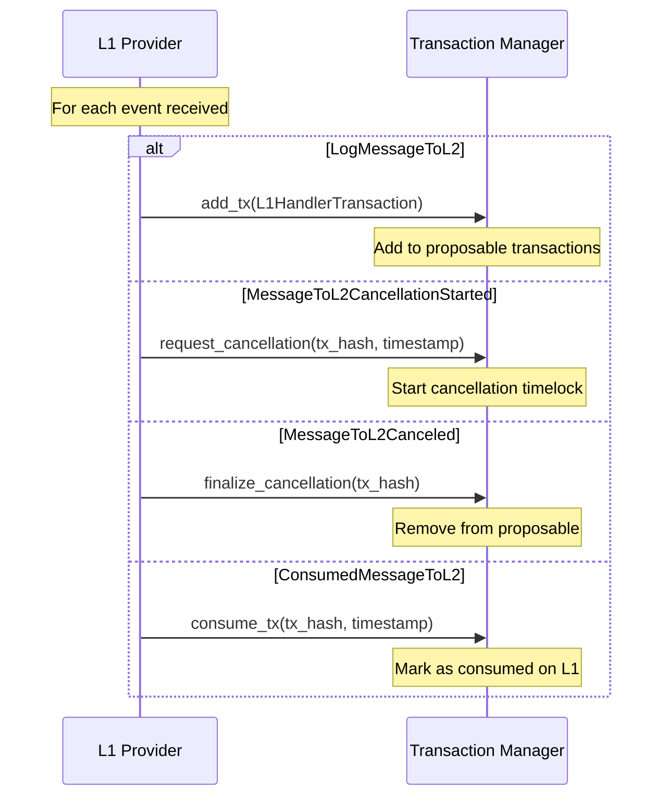
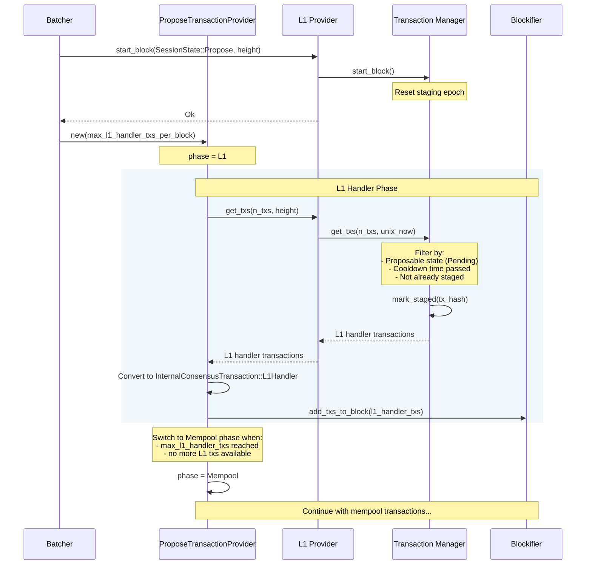
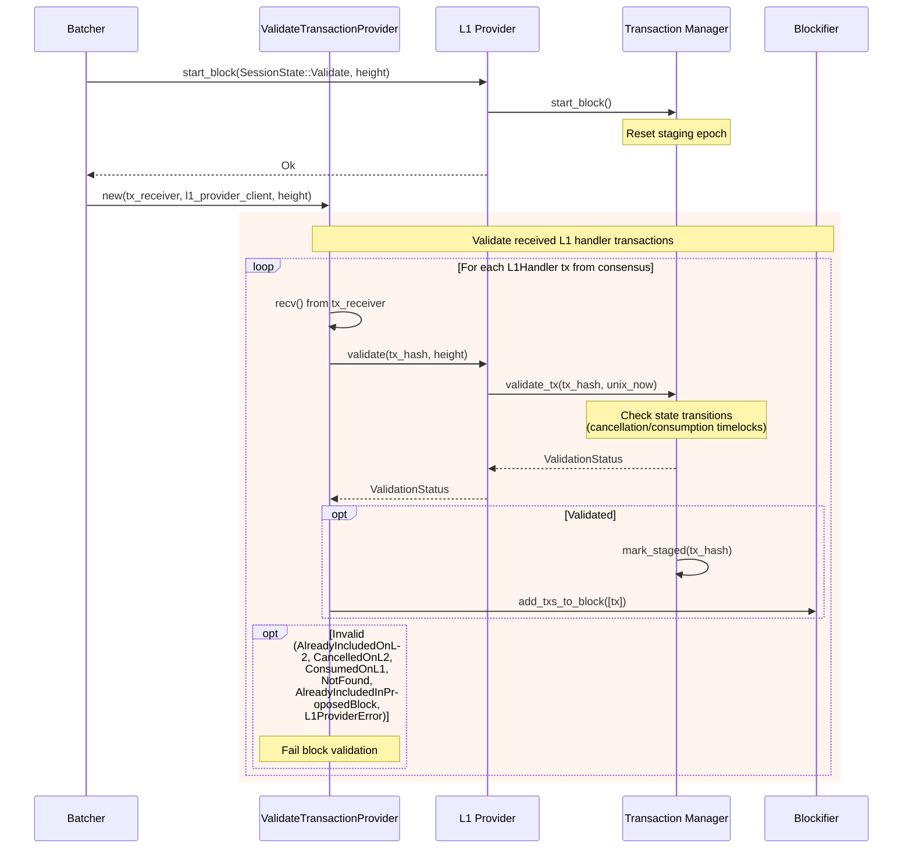
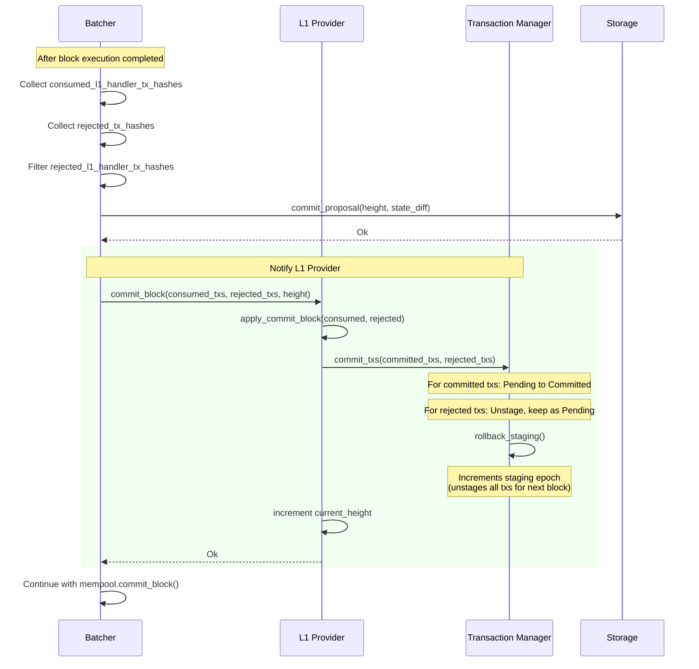

# L1 Handler Transaction Flow

## L1 Scraping - Initialization

## L1 Scraping - Continuous Polling

## L1 Event Types Handling

## Block Proposal - Getting L1 Transactions

## Block Validation - Validating L1 Transactions

## Block Commit - Finalizing L1 Transactions

